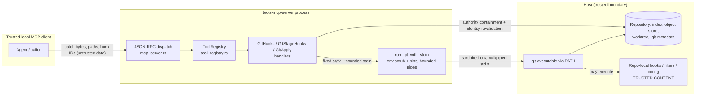

# Git Hunk-Level Staging Reference Architecture

**Scope:** The gated MCP git tool surface for non-interactive hunk-level staging: `GitApply`, `GitHunks`, `GitStageHunks`, and the shared stdin-capable git runner they depend on in `tools-mcp-git`.
**Security Classification:** High
**Audience:** Rust developers extending `tools-mcp-git`; agent/client authors consuming the hunk workflow.
**Prerequisites:** `docs/tools/git-apply.md`, `docs/tools/git-hunks.md`, `docs/tools/git-stage-hunks.md`, `docs/security.md`, `docs/configuration.md`, `docs/tools-mcp-threat-model.md`.
**Related Documentation:** `README.md` (tool inventory rows), `docs/README.md` (SDD index), `AGENTS.md` (workspace conventions).

`git add -p` is interactive and therefore unusable over MCP stdio. This surface replaces it with a deterministic three-tool contract: `GitHunks` enumerates per-file, per-hunk changes with snapshot-scoped IDs and a `diff_id` fingerprint; `GitStageHunks` stages or unstages a selected subset of those IDs and, by default (`action="prepare_commit"`), enforces a clean-index precondition, verifies the staged result at scoped and full-index granularity, and returns a ready-to-fill `GitCommit` template; `GitApply` is the lower-level primitive that applies a caller-supplied tracked-text-modification unified diff via stdin-fed `git apply`. All three register only when `MCP_ENABLE_GIT=true`. The guarantee boundary is the pre-hook staged diff: repository hooks, signing programs, and other repo-local executable surfaces remain operator-trusted.

**Normative Language:** The key words MUST, MUST NOT, REQUIRED, SHALL, SHALL NOT, SHOULD, SHOULD NOT, RECOMMENDED, MAY, and OPTIONAL are to be interpreted as described in RFC 2119 and RFC 8174 when, and only when, they appear in all capitals.

## Table of Contents

1. [Overview](#1-overview)
2. [Requirements and Non-Functional Requirements (NFRs)](#2-requirements-and-non-functional-requirements-nfrs)
3. [Key Invariants and Assumptions Audit](#3-key-invariants-and-assumptions-audit)
4. [Responsibilities and Non-Responsibilities](#4-responsibilities-and-non-responsibilities)
5. [Security and Threat Model](#5-security-and-threat-model)
6. [Privacy and Data Minimization](#6-privacy-and-data-minimization)
7. [Key Concepts](#7-key-concepts)
8. [Architecture](#8-architecture)
9. [Type Safety Model & API Contracts](#9-type-safety-model--api-contracts)
10. [Control Flow](#10-control-flow)
11. [Data Model](#11-data-model)
12. [Error Handling](#12-error-handling)
13. [Concurrency, Lifetimes, Robustness & Resource Management](#13-concurrency-lifetimes-robustness--resource-management)
14. [Configuration](#14-configuration)
15. [Dependencies and Supply-Chain Risks](#15-dependencies-and-supply-chain-risks)
16. [Common Patterns](#16-common-patterns)
17. [Common Issues](#17-common-issues)
18. [Verification Coverage](#18-verification-coverage)
19. [Debugging and Observability](#19-debugging-and-observability)
20. [Performance, Scalability & Robustness Analysis](#20-performance-scalability--robustness-analysis)
21. [Compatibility, Deployment, and Migration Boundaries](#21-compatibility-deployment-and-migration-boundaries)
22. [Alternatives Considered](#22-alternatives-considered)
23. [Related Documentation and Source References](#23-related-documentation-and-source-references)

## 1. Overview

The surface owns: hunk enumeration and identification, hunk-subset staging/unstaging, low-level supported-patch application, and the shared subprocess contract (stdin delivery, raw byte capture, env scrub/pins, timeout/cleanup) in `tools-mcp-git/src/git/mod.rs`. It deliberately does not own commit creation (`GitCommit`), whole-file staging (`GitAdd`), untracked files, or any hook/signing execution surface.

| Aspect | Approach | Rationale |
|--------|----------|-----------|
| Tool surface shape | One primitive (`GitApply`) plus an ergonomic pair (`GitHunks` -> `GitStageHunks`); no third commit-group wrapper | Fewer overlapping choices for an agent; the safe default lives on the one hunk-staging tool (`tools-mcp-git/src/tools.rs:76-144`) |
| Default action | `GitStageHunks` defaults to `action="prepare_commit"`, which owns the clean-index guard, staging, scoped verification, full-index verification, and the `GitCommit` template (`tools-mcp-git/src/git/handlers/apply.rs:87`, `apply.rs:1043-1071`, `apply.rs:1827-1880`) | The common case must not require the caller to remember pre/post index checks |
| Patch transport | Patch bytes travel on bounded child stdin, never temp files (`tools-mcp-git/src/git/mod.rs:352-368`, `mod.rs:400-404`) | No temp-file surface; size rejected pre-spawn |
| Hunk identity | Ephemeral SHA-256 IDs scoped to repo identity, staged flag, context, literal path list, and raw diff bytes (`tools-mcp-git/src/git/handlers/hunks.rs:2470-2522`) | Stale or cross-worktree replays are rejected deterministically instead of mis-applying |
| Support matrix | Closed v1 matrix: tracked regular-file textual modifications only; everything else is enumerated or rejected with machine-readable reasons (`apply.rs:467-564`, `hunks.rs:2067-2105`) | Fail closed instead of silently staging metadata, binaries, renames, or adds/deletes |
| Execution frame | All three tools require `working_dir` to resolve to the worktree toplevel with authority-contained git metadata (`hunks.rs:273-372`) | `git apply` from a subdirectory silently ignores out-of-scope paths with exit 0 |
| Uncertainty reporting | Outcomes that cannot be proven are failure-shaped: `state="state_unknown"`, `verification_unavailable`, `verification_mismatch` (`apply.rs:377-465`, `apply.rs:1245-1300`) | A mutating tool must never claim success it cannot verify |
| Gating | `MCP_ENABLE_GIT=true` only; no additional env gate (`tools-mcp-git/src/lib.rs:6-11`) | Matches the rest of the git family; the operator trust decision is a single switch |

## 2. Requirements and Non-Functional Requirements (NFRs)

### Functional Requirements

- [REQ-1] `GitHunks` enumerates unstaged (default) or staged (`staged=true`) changes as file records with per-hunk IDs, a `diff_id`, and a `recommended_next_action_template` that a caller completes by filling `hunk_ids` only. Evidence: `tools-mcp-git/src/git/handlers/hunks.rs:195-234`, `hunks.rs:2535-2591`.
- [REQ-2] `GitStageHunks` stages a selected subset of supported hunks by `(diff_id, hunk_ids)`. The default `action="prepare_commit"` MUST require an empty full cached diff before staging (`index_not_clean` otherwise), MUST verify the staged result (scoped multiset delta plus blob-level expected-result verification, then full-index verification), and MUST return `commit_ready=true` plus `commit_call_template` and `next_actions` only after all verification succeeds. Evidence: `tools-mcp-git/src/git/handlers/apply.rs:1043-1071`, `apply.rs:1767-1883`, `apply.rs:1246`, `apply.rs:1367-1378`.
- [REQ-3] Explicit `action="stage_only"` (scoped staging, no commit-readiness claim) and `action="unstage"` (reverse-apply staged hunks) MUST return `commit_ready=false` and no `commit_call_template`. Evidence: `apply.rs:78-113`, `apply.rs:1246`.
- [REQ-4] `GitApply` applies a caller-supplied unified diff via `git apply` with explicit `target` (`cached` default, `index_worktree`, `worktree`), `check_only`, `reverse`, `three_way`, `recount` (default true), `unidiff_zero`, and a fixed `whitespace` enum. `three_way=true` with `target="worktree"` is rejected (`incompatible_options`). Evidence: `tools-mcp-git/src/tools.rs:76-98`, `apply.rs:45-76`, `apply.rs:162`, `apply.rs:342-375`.
- [REQ-5] Every rejection carries a stable top-level `error_type` string; handlers never rely on message-substring matching or generic serde text errors for contract-relevant failures. Evidence: the catalog in [Section 12](#12-error-handling); golden assertion pattern `tools-mcp-server/tests/golden_contract.rs:442-466`.
- [REQ-6] Patch bytes arrive via stdin only; payloads above `MAX_GIT_STDIN_BYTES` are rejected before any child spawns. Evidence: `mod.rs:360-368`, `apply.rs:171`, `apply.rs:1107`.
- [REQ-7] All three tools register only under exact `MCP_ENABLE_GIT=true`; every other value (including case and whitespace variants) leaves the git family unregistered. Evidence: `tools-mcp-git/src/lib.rs:6-11`, `tools-mcp-server/tests/integration_test.rs:6525-6572`.
- [REQ-8] Uncertain terminal conditions (timeout, incomplete stdin delivery on a git-success exit, unproved nonzero apply, unavailable or contradicted verification, post-exec identity failure) MUST surface as failure-shaped responses (`state_unknown` / `verification_unavailable` / `verification_mismatch`) with remediation to inspect `GitStatus`/`GitDiff`. Evidence: `apply.rs:377-465`, `apply.rs:1245-1300`.
- [REQ-9] Validation, discovery, preflight, and recompute failures MUST reject before any mutating git invocation; there is no partial-success response shape. Evidence: ordering in `apply.rs:140-245` and `apply.rs:944-1197`; no-mutation integration tests listed in [Section 18](#18-verification-coverage).

### Non-Functional Requirements

| Category | Requirement | Target | Measurement | Evidence / Verification |
|----------|-------------|--------|-------------|-------------------------|
| Security | All caller inputs (patch bytes, paths, IDs, enums) validated before git spawns | 100% of documented hostile classes | Unit + integration rejection tests | `apply.rs:2443+` tests; `integration_test.rs:2448`, `3816`, `5093` |
| Security | Child git env authority scrubbed and pinned on every invocation | Denylist + 7 pins per child | Env scrub unit tests | `mod.rs:86-115`, `mod.rs:408-421`, tests at `mod.rs:755+` |
| Determinism | Diff enumeration pinned against repo/global config influence | Identical output under hostile local diff config | Pinned-arg construction tests | `hunks.rs:1701-1757` |
| Byte fidelity | Hashing/reconstruction operate on raw captured bytes, never lossy strings | 0 lossy-derived IDs | Parser operates on `stdout_bytes` | `hunks.rs:1692-1698`, `types.rs:58-59` |
| Bounded resources | Input, output, argv, parser, and response sizes capped by named constants | All caps enforced pre-work | Cap boundary tests | `tools-mcp-core/src/config.rs:19-46`; enforcement anchors in [Section 14](#14-configuration) |
| Fail-closed | Malformed/truncated/non-UTF-8 diffs yield no IDs and no mutation | 0 IDs from failed parses | Parser fail-closed tests | `hunks.rs:1776-1859` |
| Compatibility | Public envelopes of the wider git family unchanged; raw bytes stay internal | No new public raw-byte fields | Envelope tests | `types.rs:182-205`, `types.rs:278-289` |

## 3. Key Invariants and Assumptions Audit

**Key Invariants** (must never be violated - list first, enforcement second):

| Invariant | Enforcement Mechanism | Verification Method | Owning Type / Module |
|-----------|-----------------------|---------------------|----------------------|
| I-1: No git child ever inherits the server's JSON-RPC stdin | `Stdio::null()` unless an explicit stdin payload is supplied, then `Stdio::piped()` (`mod.rs:400-404`) | Pre-commit-hook EOF integration test (`integration_test.rs:3018`) | `run_git_with_stdin` |
| I-2: Stdin payloads above `MAX_GIT_STDIN_BYTES` never reach a child | Pre-spawn guard returning `GitInfraError::StdinTooLarge` (`mod.rs:360-368`); schema `maxLength` (`tools.rs:83`) | Cap boundary unit tests | `run_git_with_stdin` |
| I-3: Hunk IDs and `diff_id` bind repo identity, staged flag, context, exact literal path list/order, and raw bytes via length-delimited SHA-256 with domain tags `tools-mcp-git-hunk-v1` / `tools-mcp-git-diff-v1` | `hash_len_bytes` serialization (`hunks.rs:2470-2522`) | ID determinism/uniqueness tests (`hunks.rs:2681+`) | `hunks::diff_id`, `hunks::hunk_id` |
| I-4: The three tools execute only at the worktree toplevel with authority-contained, revalidated git metadata | `resolve_repo_context` discovery + toplevel equality + `rev-parse` cross-check (`hunks.rs:239-372`); `revalidate_repo_identity` before later probes/mutations (`hunks.rs:449`, called from `apply.rs:223`, `apply.rs:605`, `apply.rs:1635`, `apply.rs:2072`) | Metadata rejection and same-path-swap tests (`hunks.rs:2681+`; `integration_test.rs:3453`, `3492`, `5835`) | shared repo resolver in `hunks.rs` |
| I-5: `commit_ready=true` is returned only after scoped verification and full-index verification both succeed | `commit_ready` computed from verified `prepare_commit` only (`apply.rs:1245-1246`); full-index verifier (`apply.rs:1827-1880`) | Prepare-commit flow and hook-mutation detection tests (`integration_test.rs:3866`, `4011`, `4113`) | `handle_git_stage_hunks` |
| I-6: Only tracked regular-file textual modifications are stageable; every other record is enumerated unsupported or rejected before git runs | Support-matrix validation (`apply.rs:467-564`), shared path/round-trip predicate (`hunks.rs:2067-2126`), trackedness preflight (`apply.rs:633-728`), worktree leaf/ancestor preflight (`apply.rs:833-896`) | Unsupported-record and preflight rejection tests (`integration_test.rs:3609-3816`, `5430`) | `apply.rs` validators |
| I-7: Only whitelisted `git apply` flags are ever emitted; no caller string reaches argv except validated enums and literal paths | Fixed arg builder (`apply.rs:342-375`, `apply.rs:1627-1665`); pinned diff args (`hunks.rs:1701-1757`) | Arg-construction unit tests | `build_git_apply_args`, `build_hunk_diff_args` |
| I-8: No hunk IDs are minted from a truncated, malformed, non-UTF-8, over-cap, or colliding parse | UTF-8 gate (`hunks.rs:1776-1778`), truncation gate (`hunks.rs:1683`), caps (`hunks.rs:1828-1859`), collision gate (`hunks.rs:1845`) | Parser fail-closed and generated-input tests (`hunks.rs:2681+`) | `parse_unified_diff` |
| I-9: A mutating response is success-shaped only when the outcome is proven; timeout, stdin-delivery doubt, unproved nonzero, and verification faults all classify as failure-shaped | Classification precedence (`apply.rs:377-465`); stage failure shaping (`apply.rs:1711-1735`, `apply.rs:1245-1300`) | Classification precedence unit tests; state-unknown integration tests (`integration_test.rs:1233`, `1320`) | `classify_apply_result`, `verify_after_apply` |
| I-10: The served tool list contains no duplicate canonical names or alias collisions | Atomic panic preflight before registry mutation (`tools-mcp-core/src/tool_registry.rs:64-122`) | No-partial-mutation tests (`tool_registry.rs:348-357`, `555-609`); uniqueness goldens (`golden_contract.rs:130-134`, `309-313`) | `ToolRegistry::register` |
| I-11: Every git child runs with the authority env denylist removed and the seven affirmative pins set | `remove_git_authority_env` + pins (`mod.rs:86-115`, `mod.rs:672-726`, `mod.rs:408-421`) | Env scrub unit tests (`mod.rs:755+`) | `run_git_with_stdin` |
| I-12: Raw patch bytes are never logged; stderr-head logging is redacted for stdin-fed commands | `stderr_head_redacted = true` branch for stdin commands (`mod.rs:510-516`); non-stdin commands log a 200-char stderr head (`mod.rs:517-531`) | Code inspection; logging is `debug!`-level tracing | `run_git_with_stdin` |

**Assumptions Ledger**:

| Assumption | Evidence / Validation | Risk if False | Consequence When Violated |
|------------|-----------------------|---------------|---------------------------|
| A-1: The `git`/`git.exe` resolved through deployment `PATH` is the intended trusted executable | Documented trust boundary (`docs/security.md:32-34`); runner spawns by name | PATH poisoning executes arbitrary code with server privileges | Full host compromise; outside this surface's mitigations |
| A-2: Remaining repo-local config, attributes, hooks, filters, merge drivers, and worktree symlink layout are operator-trusted | Documented boundary (`docs/security.md:16-18`, `docs/tools-mcp-threat-model.md:149`); v1 rejects config includes, per-worktree config, linked worktrees, shallow/grafts/replace metadata (`hunks.rs:435`, SDD invariants `docs/tools/git-apply.md:31-46`) | Hostile repo content executes code via hooks/filters or skews unpinned behavior | Code execution inside the trusted-repository boundary; pins limit determinism drift only |
| A-3: Concurrent repository writers are arbitrated optimistically: git's index lock plus recompute-apply-verify, not server-side locking | `index_locked` classification (`apply.rs:278-311`, `apply.rs:1147-1216`); post-apply verification (`apply.rs:1767-1883`) | Concurrent mutation between recompute and apply | Detected as `verification_mismatch`/`stale_diff`/`index_locked`; a residual TOCTOU window is documented in [Section 5](#5-security-and-threat-model) |
| A-4: Repositories use the SHA-1 object format | `unsupported_object_format` rejection (`hunks.rs:769`; probes `hunks.rs:745-760`) | ID/verification math against unexpected OID widths | Fail-closed rejection, no mutation |
| A-5: The MCP caller is a trusted local client; arguments are untrusted data but the channel is not adversarial | Deployment model (`docs/tools-mcp-threat-model.md:90-104`) | A hostile caller holds the full gated mutation surface | Bounded by gate + repo-scope confinement; equivalent to threat TM-003 |
| A-6: The server authority root is the canonicalized startup cwd, cached for process lifetime | `OnceLock` authority root (`tools-mcp-git/src/git/path_policy.rs:4-25`); containment check (`path_policy.rs:44-59`) | Confinement anchored to the wrong directory | All `working_dir` resolution and repo discovery confine to the wrong root; operator must start the server from the intended root |
| A-7: MCP cancellation and graceful shutdown are not rollback; a cancelled mutating call may complete without a terminal envelope | `call_with_cancellation` awaits the executor then suppresses the response (`tool_registry.rs:150-170`; `tools-mcp-server/src/mcp_server.rs:834-902`) | Caller assumes cancel means aborted | Documented remediation: inspect `GitStatus`/`GitDiff` (and `GitLog` around `GitCommit`) after cancelling |

## 4. Responsibilities and Non-Responsibilities

### Responsibilities

- Deterministic, bounded, pinned diff enumeration with snapshot-scoped hunk identity (`hunks.rs`).
- Validated, verified hunk-subset staging/unstaging with an ergonomic commit-preparation default (`apply.rs::handle_git_stage_hunks`).
- Validated application of caller-supplied supported patches with explicit mutation targets (`apply.rs::handle_git_apply`).
- The shared git child contract: stdin delivery and metadata, raw byte capture, env scrub/pins, timeout, bounded task cleanup, direct-child `kill_on_drop` (`mod.rs:334-662`).
- Authority-bounded repository discovery, worktree-toplevel enforcement, metadata containment, and identity revalidation for these three tools (`hunks.rs:239-472`).
- Stable machine-readable error contracts for every rejection and uncertainty class ([Section 12](#12-error-handling)).

### Non-Responsibilities

- Commit creation, hook execution, or hook containment: `GitCommit` owns committing; hooks (including `post-index-change` on index writes) are trusted repo content.
- Untracked files, whole-file staging, added/deleted files, binary changes, renames/copies, mode/type changes, submodules, unmerged paths: `GitAdd`, an operator, or a future selector owns these.
- Splitting or editing within a hunk: selection granularity is exactly the enumerated hunks for the requested `context`.
- Process-tree containment: `kill_on_drop(true)` covers the direct child only; hook/grandchild descendants may outlive it (`docs/security.md:26-30`).
- Rollback on cancellation or shutdown (Assumption A-7).
- Sandboxing hostile repositories, PATH resolution, or the host (Assumptions A-1, A-2).
- Durable hunk identity: IDs expire on any relevant index/worktree/metadata change and are not portable across worktrees.

## 5. Security and Threat Model

**System Model**



Trust boundaries: (1) caller arguments and patch bytes are untrusted data inside a trusted channel; (2) the server authority root confines every filesystem and repo-metadata resolution; (3) everything to the right of the git executable (PATH resolution, repo-local executable surfaces) is operator-trusted and explicitly out of scope for containment.

**Attack Paths** (prioritized):

1. Hostile patch-header paths (`../`, absolute, drive/UNC, backslash, `.git` case variants, ADS/colon streams, reserved device names, trailing dot/space, 8.3 aliases, C-quoted variants) -> patch accepted -> `git apply` writes outside the repo or into `.git`. Mitigation: decoded-byte path validation for every path-bearing header before git runs (`hunks.rs:1556-1595` via `apply.rs:527`), pinned `core.protectNTFS/protectHFS` (`apply.rs:343-352`), git's own no-`--unsafe-paths` refusal as second layer, worktree-toplevel frame (I-4). Detection: `invalid_patch_path` rejections.
2. Subdirectory silent no-op: `git apply` from a repo subdirectory ignores out-of-scope paths with exit 0, converting `applied=true` into a lie. Mitigation: `working_dir_not_worktree_root` hard gate on all three tools (`hunks.rs:291-306`); tests `integration_test.rs:5835`, `5979`.
3. Git metadata escape/swap: linked worktrees, `.git` files, config includes, alternates, or same-path metadata replacement redirect reads/writes outside authority or to a different repo between validation and mutation. Mitigation: metadata containment + `unsupported_repository_metadata` rejections and identity revalidation before later git invocations (`hunks.rs:404-472`, `hunks.rs:1115`; `apply.rs:626-631`), precedence `git_metadata_outside_authority` over `repo_identity_changed`. Residual: a concurrent swap between the final revalidation and the spawned child remains a documented TOCTOU boundary.
4. Worktree write-through: index says tracked regular file but the worktree leaf/ancestor is a symlink, reparse point, non-regular file, or hardlink at apply time. Mitigation: worktree-shape preflight for worktree-writing targets (`apply.rs:833-896`); tests `integration_test.rs:1548-2090`. Residual: post-preflight concurrent swaps (trusted-worktree race).
5. Transport stdin leakage: a git child (or its hook) reads the server's JSON-RPC stdin. Mitigation: I-1 (`mod.rs:400-404`); test `integration_test.rs:3018`.
6. Resource exhaustion: pathological patches/diffs (huge bodies, thousands of files, deep argv) exhaust CPU/memory or overflow `CreateProcess` limits. Mitigation: the cap family in [Section 14](#14-configuration), truncation rejection before parsing (`hunks.rs:1683`), timeout clamps (`mod.rs:380-382`).
7. Log-channel exfiltration of patch content: attacker-influenced patch text echoes into shared logs via git stderr. Mitigation: I-12 stderr-head redaction for stdin-fed commands (`mod.rs:510-516`).

**Risk Register**:

| Risk | Attack Path | Likelihood | Impact | Mitigation | Residual Risk | Owner |
|------|-------------|------------|--------|------------|---------------|-------|
| Path escape via patch headers | 1 | Low | High | Dual-layer path validation + pins + toplevel frame | Negligible for documented classes | `apply.rs` validators |
| Silent no-op apply | 2 | Low | Medium | Toplevel-only gate | None within contract | shared repo resolver |
| Metadata redirection / identity swap | 3 | Low | High | Containment + revalidation + rejection of indirected layouts | Concurrent pre-spawn swap (TOCTOU) | shared repo resolver |
| Symlinked worktree write-through | 4 | Low | High | Static leaf/ancestor preflight | Concurrent swap after preflight | `validate_worktree_regular_file` |
| Hook/filter code execution | A-2 | Medium (hostile repo) | High | Out of scope: documented operator trust; env/attr pins limit config influence only | Full, by design | operator |
| PATH poisoning | A-1 | Low | Critical | Out of scope: documented trust boundary | Full, by design | operator |
| Unverifiable mutation reported as success | 8 (internal) | Low | Medium | I-9 failure-shaped uncertainty; post-apply verification | Body-identical relocation subtleties covered by blob-level verifier | `verify_after_apply` |
| Resource exhaustion | 6 | Medium | Low | Cap family + clamps + truncation rejection | Bounded degradation | `config.rs` caps |

**Highest-Risk Acceptance Boundary**: the architecture is acceptable only under Assumptions A-1 and A-2 (trusted git executable and trusted repo-local executable content). If either fails, no mitigation in this surface prevents code execution; `MCP_ENABLE_GIT=true` is therefore an operator trust decision per repository, as documented in `docs/security.md:16`.

**Mitigation Evidence & Robustness Gate** (failure modes addressed, >= 3):

1. Timeout: child killed, 2s reap grace, `TimeoutReapFailed` if unreaped; result classified `state_unknown("timeout")`, never a fabricated exit (`mod.rs:462-484`, `apply.rs:384`).
2. Incomplete stdin delivery on a git-success exit: promoted to `state_unknown("stdin_write")` because git may have acted on a truncated prefix (`apply.rs:420-428`; stage variant `apply.rs:1139`, `1209`).
3. Capture task failure/join timeout: bounded 2s join, abort, typed infrastructure error overriding any child result; never masked as empty output (`mod.rs:618-637`, `mod.rs:488-491`).
4. Index-lock contention: classified `index_locked` via the resolved `git rev-parse --git-path index.lock` path, not substring matching (`apply.rs:278-311`; tests `integration_test.rs:2281`, `4500`).
5. Truncated diff capture: `diff_output_too_large` before parsing; no IDs, no mutation (`hunks.rs:1683`; test `integration_test.rs:5314`).

- **Attack Surface**: three gated JSON-RPC tools (`tools.rs:76-144`); patch bytes on stdin; literal path filters; hunk ID strings; `working_dir`.
- **Authentication / Authorization invariants**: none internal; the gate plus local-transport trust model govern (threat model TM-003).
- **Secrets handling**: no secrets processed; env scrub removes `GIT_SSH*`/`GIT_ASKPASS`/`SSH_ASKPASS` influence from children (`mod.rs:86-115`); `GIT_NO_LAZY_FETCH=1` prevents credential-helper-backed network fetches (`mod.rs:419`).
- **Audit logging requirements**: tracing at `warn!`/`debug!` records args, exit codes, truncation flags; stdin-fed command stderr heads are redacted (I-12).

## 6. Privacy and Data Minimization

**Privacy Summary**

- Data subjects / classes: repository content (diff text, file paths) supplied by the operator's own worktree; no PII/PHI/PCI processing beyond whatever the repository itself contains.
- Purpose: transient computation of diffs, IDs, and staged state. Retention: none; the server keeps no enumeration state between calls (`diff_id` replay is recomputed, `apply.rs:1010`). Residency: local host only; `GIT_NO_LAZY_FETCH=1` forbids network object fetches.

- **Data Inventory**: request args (patch bytes, paths, IDs) held in memory for the request lifetime; responses carry diff-derived text back to the trusted caller; tracing logs carry argv, exit codes, and (non-stdin commands only) a 200-char stderr head.
- **Data Flow & Boundaries**: see the DFD in [Section 5](#5-security-and-threat-model); no persistence layer exists.
- **Minimization Contract**: responses expose `diff_bytes` counts rather than raw envelope diff stdout for enumeration (`hunks.rs:2565-2582`); raw patch bytes are never logged (I-12).
- **Risks, Mitigations & Robustness Gate**: (1) patch content in logs -> stderr-head redaction; (2) oversized repository content in responses -> `MAX_GIT_STRUCTURED_RESPONSE_BYTES` (`hunks.rs:1855-1859`); (3) content leaving the host -> no network paths, lazy fetch disabled.
- **Verification**: log-redaction branch (`mod.rs:510-516`); response cap tests (`hunks.rs:2681+`).

## 7. Key Concepts

| Term | Description |
|------|-------------|
| `diff_id` | `sha256:<64 lowercase hex>` fingerprint of one scoped diff: domain tag `tools-mcp-git-diff-v1`, repo identity, staged flag, context, literal path list/order, full raw diff bytes (`hunks.rs:2470-2487`). A replay token for exactly one repository/worktree state, not a durable ID. |
| Hunk ID | `{file_index}.{hunk_index}.{hash64}`; zero-based indices in parsed diff order (unsupported files included in `file_index`); hash over domain tag `tools-mcp-git-hunk-v1`, repo identity, staged flag, context, paths, old/new path identity, raw header bytes, raw body bytes (`hunks.rs:2489-2517`). |
| Repo identity | Canonical worktree/metadata identity bytes folded into every ID so cross-worktree replay of byte-identical diffs is rejected (`hunks.rs:2479`, `2505`). |
| Source direction | The diff a `GitStageHunks` action reads from: unstaged (`git diff`) for `prepare_commit`/`stage_only`, staged (`git diff --cached`) for `unstage` (`apply.rs:106-108`). |
| Mixed-direction file | A selected file path appearing in any non-`/dev/null` path-bearing field of the opposite-direction diff; rejected pre-mutation because the verifier is not layered-index-aware (`apply.rs:1555`). |
| Match key | `(canonical file path bytes, raw hunk body bytes)` - the unit of the post-apply multiset verifier; `@@` headers are excluded because start lines drift with sibling staging (`apply.rs:2169-2232`). |
| Commit group | The exact selected hunk set that default `prepare_commit` proves is the entire cached diff before returning `commit_ready=true`. |
| `prepare_commit` | Default `GitStageHunks` action: clean-index guard -> stage -> scoped verify -> full-index verify -> `GitCommit` template (`apply.rs:87`, `apply.rs:1043-1071`, `apply.rs:1827-1880`). |
| Support matrix (v1) | The closed set of stageable records: tracked regular-file (`100644`/`100755`) textual modifications with identical old/new paths, non-binary, `change_kinds == ["modified"]` (`hunks.rs:2006`, `2067-2105`). |
| `state_unknown` | Terminal classification meaning the mutation outcome cannot be proven; always failure-shaped with inspect-remediation (`apply.rs:377-465`). |
| `verification_state` | `verified` / `verification_mismatch` / `verification_unavailable`; `verified` is the only success value (`apply.rs:1245-1287`). |
| Authority root | The canonicalized server startup cwd; every path and repo-metadata resolution must stay at or under it (`path_policy.rs:4-59`). |
| Snapshot-scoped | Valid only until any relevant index/worktree/HEAD/metadata change; consumers re-enumerate after every mutation round. |

## 8. Architecture

### 8.1 Key Modules

| Module | Role | Evidence |
|--------|------|----------|
| `tools-mcp-git/src/tools.rs` | Tool names, schemas, registration order for the git family | `tools.rs:76-144`, `333-349` |
| `tools-mcp-git/src/lib.rs` | `MCP_ENABLE_GIT` gate | `lib.rs:6-11` |
| `tools-mcp-git/src/git/mod.rs` | Shared runner: `run_git` (wrapper) and `run_git_with_stdin`; safety prefix, env scrub/pins, stdin writer, capture tasks, timeout/cleanup, `GitInfraError` | `mod.rs:334-662`, `mod.rs:117-152`, `mod.rs:199-207` |
| `tools-mcp-git/src/git/types.rs` | `GitExecResult` (raw bytes + stdin summary), envelope builders including the `isError`-override builder | `types.rs:48-97`, `types.rs:136-205` |
| `tools-mcp-git/src/git/handlers/hunks.rs` | `handle_git_hunks`, `parse_unified_diff`, ID minting, shared repo resolver / identity revalidation, shared path validators, response builder | `hunks.rs:195`, `1769`, `2470-2522`, `239-472`, `1505-1640`, `2535-2640` |
| `tools-mcp-git/src/git/handlers/apply.rs` | `handle_git_apply`, `handle_git_stage_hunks`, support-matrix and preflight validators, patch reconstruction, apply classification, post-apply verifiers, commit template | `apply.rs:140`, `944`, `467-942`, `1579-1625`, `377-465`, `1767-2284`, `2413-2441` |
| `tools-mcp-git/src/git/path_policy.rs` | Authority-root containment for caller-supplied directories | `path_policy.rs:4-189` |
| `tools-mcp-core/src/config.rs` | The cap/constant family | `config.rs:4-46` |
| `tools-mcp-core/src/tool_registry.rs` | `define_mcp_tool!`, collision-rejecting registration, cancellation-scoped dispatch | `tool_registry.rs:212-244`, `64-122`, `150-170` |

Handler wiring: `handlers/mod.rs` re-exports `handle_git_apply`/`handle_git_stage_hunks` (from `apply.rs`) and `handle_git_hunks` (from `hunks.rs`) to `tools.rs`; `tools_mcp_git::register_tools` is invoked from the composition root (`tools-mcp-server/src/composition.rs:83-94`).

### 8.2 Trust Boundaries & Data Flows

The DFD in [Section 5](#5-security-and-threat-model) is normative. Least-privilege enforcement points, in order of encounter: schema validation (`additionalProperties:false` + `deny_unknown_fields`), authority containment (`path_policy.rs:44-59`), repo discovery/toplevel/metadata validation (`hunks.rs:239-472`), input caps, support matrix, trackedness/worktree preflights, env scrub/pins at spawn, and post-execution verification before any success-shaped response.

### 8.3 Cryptography / Protocol Flows

SHA-256 is used solely as a content fingerprint for `diff_id`/hunk IDs (collision-resistant identity, no secrecy or authentication claims). Length-delimited field serialization (`hash_len_bytes`, `hunks.rs:2519-2522`) provides domain separation between fields and versions. Not applicable otherwise.

## 9. Type Safety Model & API Contracts

| Type / API | Purpose | Safety Guarantees | Smart Constructor / Typestate / Capability | Misuse Prevention |
|------------|---------|-------------------|--------------------------------------------|-------------------|
| `GitApplyRequest` (`apply.rs:21-43`) | GitApply args | `deny_unknown_fields`; schema `additionalProperties:false` | serde + custom parse-to-`error_type` mapping | Unknown/invalid fields -> `invalid_request`, never text-only serde errors |
| `ApplyTarget` (`apply.rs:45-76`) | Mutation target | Closed enum `cached`/`index_worktree`/`worktree`; `writes_index()` narrows lock semantics | Parse with default `cached` | `three_way` + `worktree` -> `incompatible_options` (`apply.rs:162`) |
| `StageAction` (`apply.rs:78-113`) | GitStageHunks action | Closed enum, default `prepare_commit`; `source_staged()` derives diff direction | Parse with default | No `reverse` boolean exists; direction confusion is unrepresentable |
| `GitStageHunksRequest` (`apply.rs:115-138`) | Stage args | Required `diff_id` (`^sha256:[0-9a-f]{64}$`) and `hunk_ids` (pattern + `maxLength:96` + `uniqueItems` + `minItems:1`) | Schema at `tools.rs:128-129`; checked integer parsing of indices, byte-equality canonicalization (`apply.rs:1393-1442`) | Overflowing/noncanonical/duplicate IDs -> `malformed_hunk_ids` |
| `GitExecResult` (`types.rs:48-64`) | Child outcome | Carries `stdout_bytes`/`stderr_bytes` (raw), truncation flags, `timed_out`, `stdin: GitStdinSummary`; `success = exit 0 && !timed_out` (`mod.rs:538`) | Constructed only by the runner (`mod.rs:533-547`) | Byte-critical consumers parse `stdout_bytes`, never lossy strings (`hunks.rs:1693`) |
| `GitStdinSummary` (`types.rs:66-89`) | Stdin delivery proof | `fully_delivered`, `write_error`, `broken_pipe` | `from_report` | Success-shaped `applied`/`checked` require full delivery (I-9) |
| `GitInfraError` (`mod.rs:117-152`) | Typed infrastructure failures | Variants for stdin-too-large, spawn, missing pipe, wait, kill/reap, capture task/read/join-timeout | Matched by variant, not string | Capture faults override child results; no fabricated `GitExecResult` |
| `build_git_response_with_is_error` (`types.rs:164-180`) | Envelope override | Can force `isError:true` on a git-success exec | - | Verification faults after exit 0 are representable as errors |
| `ToolRegistry::register` (`tool_registry.rs:64-122`) | Registration | Atomic panic preflight; no partial mutation | `assert_can_register` before any insert | Duplicate/alias collisions are startup-fatal |

GitApply schema (served; `tools.rs:80-96`): `patch` (required, `minLength:1`, `maxLength` = `MAX_GIT_STDIN_BYTES`), `target` enum default `cached`, `check_only=false`, `reverse=false`, `three_way=false`, `recount=true`, `unidiff_zero=false`, `whitespace` enum default `nowarn`, `working_dir`, `timeout_ms >= 100` default 30000.
GitHunks schema (`tools.rs:104-117`): `staged=false`, `paths` (`maxItems` = `MAX_GIT_PATHSPECS`, items `minLength:1`), `context >= 0` default 3, `max_bytes` default 200000 max 5000000, `working_dir`, `timeout_ms`, `include_advanced_templates=false`.
GitStageHunks schema (`tools.rs:125-142`): required `diff_id` + `hunk_ids`; `action` enum default `prepare_commit`; `context` default 3 and `paths` MUST replay the enumeration scope (enforced solely through the recomputed `diff_id`, since the server holds no enumeration state); optional `commit_type`/`commit_scope`/`commit_message` flow only into the returned template.

**Static Analysis and Compile Gates**:

| Check | Tool / Lint | Gate |
|-------|-------------|------|
| Formatting | `cargo fmt --all -- --check` (`justfile` `fmt-check`) | CI/local verification baseline |
| Lints as errors | `cargo clippy --workspace -- -D warnings` (`justfile` `lint`) | CI/local verification baseline |
| Schema strictness | `golden_all_object_tool_schemas_disallow_unknown_fields` (`golden_contract.rs:359-383`) | Every object schema sets `additionalProperties:false` |
| Selection-constraint goldens | `golden_git_hunk_tool_schemas_expose_selection_constraints` (`golden_contract.rs:385-440`) | Patterns, enums, defaults, caps for all three schemas |
| Inventory exactness | `golden_readme_tool_inventory_matches_tools_list` (`golden_contract.rs:318-346`) | Documented set == served set, no duplicates |

**Unsafe Rust**: none in this surface.

## 10. Control Flow

### 10.1 GitHunks (read-only)

1. Parse args (`deny_unknown_fields`; invalid -> `invalid_request`); validate `timeout_ms >= 100` (`hunks.rs:1505-1515`); clamp `max_bytes`.
2. Validate literal `paths` (`invalid_pathspec` / `path_complexity_limit`; `hunks.rs:1518-1541`, hostile-form predicate `hunks.rs:1556-1595`). Entries are never filtered, trimmed, deduplicated, or reordered.
3. Resolve repo context: authority containment, bounded manual discovery of a real `<worktree>/.git`, toplevel equality, `rev-parse` cross-check, object-format probe, metadata containment (`hunks.rs:220`, `239-372`, `404-472`, `745-769`).
4. Revalidate identity, then run the pinned diff command (`hunks.rs:1646`, `1701-1757`) through the shared runner (null stdin, env scrub/pins).
5. Gate the exec result: spawn/timeout/nonzero/truncation -> `git_diff_unavailable` / `git_diff_timeout` / `git_diff_failed` / `diff_output_too_large` (`hunks.rs:1658-1683`).
6. Parse raw `stdout_bytes` (`hunks.rs:1692-1698`, `1769-1859`): UTF-8 gate, record splitting, support classification, caps, collision gate.
7. Mint IDs, build the structured response with `recommended_next_action(_template)` and the opt-in `advanced_stage_only_template` (`hunks.rs:2014-2025`, `2535-2591`).

### 10.2 GitApply

1. Syntactic validation in precedence order: args shape/enums/timeout -> `invalid_request`; `three_way`+`worktree` -> `incompatible_options`; patch byte length -> `stdin_too_large`; trimmed-empty -> `empty_patch` (`apply.rs:140-183`).
2. Resolve repo context (same shared resolver; `apply.rs:189`) -> toplevel/authority/metadata/object-format gates.
3. Parse and validate the patch against the closed support matrix: header path validation (`invalid_patch_path`), record support (`unsupported_patch_record`), header cross-consistency, `index <old>..<new>` blob/mode rules, no-op rejection, caps (`patch_complexity_limit`) (`apply.rs:467-564`).
4. Reject any pre-existing unmerged index (`unmerged_index`; probe faults map to `unmerged_index_probe_*`) (`apply.rs:593-621`).
5. Trackedness/type preflight: literal-pathspec `ls-files -s -v --debug -z`; require exactly one stage-0 regular-file entry per target; reject intent-to-add/skip-worktree/assume-unchanged flags (`apply.rs:633-728`).
6. For worktree-writing targets, worktree-shape preflight: reject symlink/reparse ancestors, non-regular or hardlinked leaves (`apply.rs:833-896`, invoked `apply.rs:203-209`).
7. Revalidate identity, spawn `git apply` with fixed args and piped stdin (`apply.rs:214-245`).
8. Classify (first match wins; `apply.rs:278-311`, `377-465`): `index_locked` short-circuit -> timeout -> non-check `three_way` nonzero (conflict probe -> `three_way_conflict` with `conflicted=true`, else `three_way_indeterminate`) -> git-success with incomplete stdin -> `state_unknown("stdin_write")` -> check success -> `checked` -> apply success -> `applied` (after post-exec identity revalidation) -> check nonzero -> `failed` -> otherwise `state_unknown("unproved_git_nonzero")`.

### 10.3 GitStageHunks

1. Syntactic validation before any git command: `diff_id` shape, `hunk_ids` pattern/count/canonicalization (`malformed_hunk_ids`), `action`, `paths` (identical rules to GitHunks) (`apply.rs:944-968`, `1393-1442`).
2. Resolve repo context (`apply.rs:972`); reject unmerged index (`unmerged_index` / probe variants; `apply.rs:593-621` shared path).
3. `prepare_commit` only: enumerate the full cached diff; non-empty -> `index_not_clean`, no mutation (`apply.rs:1043-1071`).
4. Recompute the source-direction diff with the identical pinned command; any recompute fault is a pre-mutation error with its specific code. If the recomputed `diff_id` differs from the supplied one, check the opposite direction: match there -> `direction_mismatch`; otherwise `stale_diff` (with `direction_check_unavailable=true` + `cause_error_type` when the opposite check itself failed) (`apply.rs:1002-1023`).
5. Map every requested ID against the recomputed source diff: `unknown_hunk_ids`, `unsupported_hunk_ids` (IDs on enumerated-but-unsupported records), `ambiguous_hunk_ids` (same match key occurring more often than requested multiplicity) (`apply.rs:1480-1524`).
6. Enumerate the opposite-direction diff; selected path present in any path-bearing field -> `mixed_direction_file`; enumeration fault -> `direction_check_unavailable` (`apply.rs:1555-1566`). Record pre-apply match-key multisets for both directions.
7. Reconstruct the patch in recomputed diff order, selected hunks only, preserving exact header/body bytes; cap the result (`diff_complexity_limit` / `MAX_GIT_STDIN_BYTES`) (`apply.rs:1579-1625`, `1107-1109`).
8. Preflight `git apply --cached --check` with byte-identical stdin and flags; faults map to `preflight_unavailable` / `preflight_timeout` / `preflight_stdin_write_failed` / `preflight_failed` / `index_locked`, all no-mutation (`apply.rs:1116-1171`).
9. Actual apply (`--cached --recount --whitespace=nowarn`, `-R` for unstage, `--unidiff-zero` when `context=0`; `apply.rs:1627-1665`, `apply.rs:1185-1197`); faults map to `git_apply_unavailable` / `apply_timeout` / `stdin_write_failed` / `git_apply_failed` / `index_locked` (`apply.rs:1199-1227`).
10. Post-apply verification (`apply.rs:1767-1883`): re-enumerate both scoped directions; verify per-key multiset deltas (requested keys move by exactly the requested multiplicity; unrequested keys unchanged) plus blob-level expected-result verification of selected index blobs (`apply.rs:1885-1974`, `2050-2107`). Faults -> `verification_unavailable`; contradictions -> `verification_mismatch`; both failure-shaped with `state="state_unknown"`.
11. `prepare_commit` only: full-index verification (full cached diff == exactly the selected group; full unstaged diff == baseline minus the group, unselected-file inventories unchanged) -> `commit_group_verification_unavailable` / `commit_group_verification_mismatch` on fault/contradiction (`apply.rs:1827-1880`, `2234-2284`).
12. Success response: `state="applied"`, `verification_state="verified"`, `applied_hunk_ids`, post-apply diff IDs; `prepare_commit` adds `commit_ready=true`, `full_index_clean_before`, `full_index_verified_after`, `pre_commit_verification`, `commit_call_template`, `next_actions` (`apply.rs:1296-1378`).

State transition summary for a hunk ID: minted (GitHunks) -> replayed (`diff_id` match) -> consumed (staged/unstaged and expired) | rejected (stale/direction/unknown/unsupported/ambiguous/mixed). Any index/worktree/HEAD/metadata change transitions all outstanding IDs to stale; consumers MUST re-enumerate after every mutation round.

## 11. Data Model

All state is in-memory per request; the server persists nothing between calls. There is no schema-evolution surface.

- **Canonical ID serialization**: every hashed field is length-prefixed (`u64` little-endian) before its bytes (`hunks.rs:2519-2522`); domain tags version the scheme (`tools-mcp-git-hunk-v1`, `tools-mcp-git-diff-v1`). Changing any serialized field or ordering is a breaking ID-scheme change and requires a domain-tag bump.
- **File record** (`hunks.rs:66-81`): `file_index`, `path`, `old_path?`, `status` (precedence `unmerged > added > deleted > renamed > copied > type_changed > submodule > mode_changed > modified`; `hunks.rs:2155-2177`), `change_kinds[]`, `binary` (metadata flag, never a status), `supported_for_stage_hunks`, `unsupported_reason?` (`invalid_path`, `binary`, `unsupported_index_header`, `hunkless`, `old_new_path_mismatch`, `unsupported_change_kind`, `unsupported_path`, `combined_or_unmerged_diff`; `hunks.rs:2067-2105`, `1896`), `diff_header`, `old_file_header?`, `new_file_header?`, `extended_headers[]`, `hunks[]`.
- **Hunk record** (`hunks.rs:2628-2640`): `id`, `file_index`, `hunk_index`, `header`, `old_start`, `old_lines`, `new_start`, `new_lines`, `body` (raw ` `/`+`/`-` lines plus `\ No newline at end of file` markers, no CRLF normalization).
- **GitHunks response** (`hunks.rs:2565-2588`): `diff_id`, `staged`, `context`, `paths`, `max_bytes`, `diff_bytes` (count, not content), `counts{files,hunks,hunk_body_bytes}`, `recommended_next_action`, `recommended_next_action_template` (a complete `GitStageHunks` call with empty `hunk_ids`), `files[]`, optional `advanced_stage_only_template` (only when `include_advanced_templates=true` and unstaged).
- **GitStageHunks response** (`apply.rs:1296-1378`; field list `docs/tools/git-stage-hunks.md:69`): `state`, `action`, `source_diff_id` (echo), `pre_apply_diff_id` (trustworthy recompute; MUST equal `source_diff_id` or the request failed pre-apply), `requested_hunk_ids`, `applied_hunk_ids`, post-apply scoped and (for `prepare_commit`) full diff IDs, `verification_state`, `commit_ready`, optional `commit_call_template` (`apply.rs:2413-2441`: `GitCommit` args with `working_dir` copied through and `type`/`scope`/`message` from optional request fields, placeholders marked as placeholders otherwise), `next_actions`.
- **GitApply response**: standard git envelope (`types.rs:192-204`: `content`, `isError`, `git_bin`, `args`, `working_dir`, `exit_code`, `timed_out`, `truncated_stdout/stderr`, `stdout`, `stderr`) plus `state`, `applied`, `checked`, `target`, `reverse`, `three_way`, optional `conflicted`, `state_unknown_reason`, stdin diagnostics; built with the `isError`-override builder when verification converts a git-success exec into an error (`types.rs:164-180`).
- **Encoding contract**: response text fields are exact UTF-8 of parsed raw bytes; non-UTF-8 anywhere fails closed (`non_utf8_diff`), never lossy conversion of hashed content. The envelope `stdout`/`stderr` strings remain lossy display fields for humans (`types.rs:45`, debug-asserted consistent at `types.rs:183-190`).

## 12. Error Handling

Contract: validation and no-exec failures use `ToolCallOutcome::err_with` with a stable top-level `error_type` plus structured offenders/remediation; git-exec-backed failures use custom standard-envelope responses preserving args/stderr/exit/truncation metadata while still setting `error_type` and `isError:true`; handlers never panic (`AGENTS.md:90`). Tests assert the `error_type` field, never message substrings (pattern: `golden_contract.rs:442-466`).

**Request validation** (no git spawned):

| `error_type` | Trigger | Anchor |
|---|---|---|
| `invalid_request` | Unknown fields, invalid types/enums, `timeout_ms < 100` | `apply.rs:154`, `hunks.rs:1505-1515` |
| `incompatible_options` | `three_way=true` with `target="worktree"` | `apply.rs:162` |
| `stdin_too_large` | `patch` bytes > `MAX_GIT_STDIN_BYTES` | `apply.rs:173` |
| `empty_patch` | Patch empty after trim | `apply.rs:179` |
| `malformed_hunk_ids` | Pattern/length/count/overflow/noncanonical/duplicate-resolved IDs | `apply.rs:1406-1422` |
| `invalid_pathspec` | Malformed literal path entry (NUL, absolute, backslash, drive/ADS, `..`, `.git`, reserved names, 8.3 aliases, trailing dot/space) | `hunks.rs:1533`, `1556-1595` |
| `path_complexity_limit` | `paths` count/byte/argv caps | `hunks.rs:1519`, `1541` |
| `patch_complexity_limit` | Patch-header path count / argv caps | `apply.rs:499-504`, `551-559` |

**Patch content** (GitApply, pre-spawn):

| `error_type` | Trigger | Anchor |
|---|---|---|
| `invalid_patch_path` | Hostile decoded header path in any path-bearing header | `apply.rs:183`, `511-529` |
| `unsupported_patch_record` | Outside the closed matrix: add/delete/rename/copy/mode/type/binary/submodule/unmerged/hunkless/no-op records, bad `index` headers, preflight-rejected targets, hostile worktree shapes | `apply.rs:519`, `682-720`, `850-889` |

**Repository discovery, authority, metadata** (shared resolver):

| `error_type` | Trigger | Anchor |
|---|---|---|
| `working_dir_invalid` | Authority-contained but empty/nonexistent/non-directory/non-normalizable | `hunks.rs:251` |
| `working_dir_outside_authority` | Lexical or resolved authority escape | `hunks.rs:416` |
| `working_dir_not_worktree_root` | Discovered toplevel differs from resolved `working_dir` | `hunks.rs:293` |
| `repo_not_found_within_authority` | No authority-contained repository root can be proven | `hunks.rs:280` |
| `working_dir_probe_unavailable` / `_timeout` / `_failed` | `rev-parse` probe infrastructure faults | `hunks.rs:321-350` |
| `git_metadata_outside_authority` | Metadata path/include/layout escapes authority (takes precedence over `repo_identity_changed`) | `hunks.rs:1115`; precedence `apply.rs:626-631` |
| `unsupported_repository_metadata` | Authority-contained but unsupported layout: linked worktrees/`.git` files, config includes, per-worktree config, sparse/split index (`link`/`sdir` extensions), shallow/grafts/replace refs, symlinked object-store/fanout dirs | `hunks.rs:435` |
| `repo_identity_changed` | Same-path metadata replacement/content change between validation and a later git invocation | `hunks.rs:455`, `apply.rs:629` |
| `unsupported_object_format` (+ `object_format_probe_*`) | Non-SHA-1 repository / probe faults | `hunks.rs:769`, `745-760` |

There is no `repo_discovery_outside_authority` code: an undiscoverable or above-authority root uniformly maps to `repo_not_found_within_authority`, with `git_metadata_outside_authority` reserved for proven metadata escapes.

**Index state and preflight**:

| `error_type` | Trigger | Anchor |
|---|---|---|
| `unmerged_index` (+ `unmerged_index_probe_*`) | Pre-existing unmerged entries / probe faults; global pre-mutation gate | `apply.rs:593-621` |
| `index_not_clean` | Non-empty full cached diff before default `prepare_commit` | `apply.rs:1056` |
| `trackedness_preflight_unavailable` / `_timeout` / `_failed` | `ls-files` preflight infrastructure faults | `apply.rs:659-673` |
| `index_locked` | Any git-apply invocation (preflight or actual) blocked by the resolved `index.lock` path | `apply.rs:311`, `1147`, `1216` |

**Diff enumeration / recompute** (GitHunks and GitStageHunks recomputes; all pre-mutation):

| `error_type` | Trigger | Anchor |
|---|---|---|
| `git_diff_unavailable` / `git_diff_timeout` / `git_diff_failed` | Spawn fault / timeout / nonzero exit | `hunks.rs:1658-1673` |
| `diff_output_too_large` | Truncated capture; no partial parse | `hunks.rs:1683` |
| `diff_parse_error` | Structurally malformed/unknown/ambiguous records | `hunks.rs:1807` |
| `non_utf8_diff` | Diff bytes are not valid UTF-8 | `hunks.rs:1778` |
| `diff_complexity_limit` | File/hunk/body/response/reconstructed-patch caps | `hunks.rs:2532`, `apply.rs:1109` |
| `hunk_id_collision` | Duplicate full ID within one response | `hunks.rs:1845` |

Raw-byte capture is unconditional in the shared runner; capture faults surface as typed `GitInfraError` infrastructure failures (`mod.rs:141-152`) rather than distinct diff-level codes.

**Selection** (GitStageHunks, pre-mutation):

| `error_type` | Trigger | Anchor |
|---|---|---|
| `stale_diff` | Recomputed source `diff_id` differs and the opposite direction does not explain it | `apply.rs:1010-1023` |
| `direction_mismatch` | Supplied `diff_id` matches the opposite direction | `apply.rs:1002` |
| `direction_check_unavailable` | Opposite-direction enumeration fault (after source-ID errors are exhausted) | `apply.rs:1566` |
| `unknown_hunk_ids` | ID absent from the matching source diff | `apply.rs:1487` |
| `unsupported_hunk_ids` | ID belongs to an enumerated-but-unsupported record | `apply.rs:1480` |
| `ambiguous_hunk_ids` | Same-body subset selection the verifier cannot prove | `apply.rs:1524` |
| `mixed_direction_file` | Selected path present in the opposite-direction diff | `apply.rs:1555` |

There is no separate scope-mismatch code: with a matching `diff_id` the scope provably matches (misses are `unknown_hunk_ids`); with a mismatch, step 4 already returned `stale_diff`/`direction_mismatch`.

**Apply execution and verification**:

| `error_type` | Trigger | State | Anchor |
|---|---|---|---|
| `preflight_unavailable` / `_timeout` / `_failed` / `preflight_stdin_write_failed` | Preflight `--check` faults; no mutation | `failed` | `apply.rs:1131-1171` |
| `git_apply_unavailable` | Actual-apply spawn/setup fault | `failed`/`state_unknown` | `apply.rs:240`, `1659` |
| `apply_timeout` | Actual apply timed out | `state_unknown` | `apply.rs:1201` |
| `stdin_write_failed` | Incomplete delivery on a success-shaped exit | `state_unknown` | `apply.rs:1209` |
| `git_apply_failed` | Nonzero actual apply | `failed` (proven classes) / `state_unknown` | `apply.rs:1219` |
| `verification_unavailable` | Post-apply re-enumeration fault after exit 0 | `state_unknown` | `apply.rs:1255` |
| `verification_mismatch` | Scoped verifier contradiction | `state_unknown` | `apply.rs:1259` |
| `commit_group_verification_unavailable` / `_mismatch` | Full-index verifier fault / contradiction (`prepare_commit`) | `state_unknown` | `apply.rs:1269-1276`, `2395` |

Every row in this last table carries `isError:true`, `commit_ready=false`, `applied=false`, `checked=false`, and remediation to inspect `GitStatus`/`GitDiff` wherever `state_unknown` is possible.

## 13. Concurrency, Lifetimes, Robustness & Resource Management

| Concern | Rule / Guarantee |
|---------|------------------|
| Thread safety | Handlers are `async fn` on owned data; the runner owns the `Child` inline (no detached wait task), so dropping the run future drops the child |
| Stdin writer | Spawned task, 16 KiB chunks, `shutdown()` for EOF, runs concurrently with readers and child wait - never awaited before the wait/timeout path, preventing pipe-buffer deadlock (`mod.rs:435-446`, `558-616`) |
| Capture tasks | Bounded reads (`read_to_end_limited`); joined with 2000 ms grace then aborted; join/read faults are typed infrastructure errors that override child results (`mod.rs:457-460`, `618-637`) |
| Stdin collection | Diagnostic only: join faults downgrade to a `StdinWriteReport`, never fatal on their own (`mod.rs:639-662`) |
| Timeout | `timeout_ms` clamped to `[100, MAX_GIT_TIMEOUT_MS]`; on expiry: kill, 2 s reap grace, `TimeoutReapFailed` if unreaped (`mod.rs:380`, `462-484`) |
| Future-drop cleanup | `kill_on_drop(true)` (`mod.rs:406`) kills the direct child if the request future is dropped; detached pipe tasks terminate when the child's handles close; descendants are NOT covered |
| Cancellation | Cooperative token is scoped but the executor runs to completion; the server suppresses the terminal response (`tool_registry.rs:150-170`, `mcp_server.rs:834-902`); not rollback (A-7) |
| Concurrent repo writers | Optimistic recompute -> preflight -> apply -> verify; git's own index lock arbitrates (`index_locked`); post-apply verifiers catch interleaved mutation (`verification_mismatch`) |
| Resource exhaustion (CWE-400) | Caps in [Section 14](#14-configuration) bound stdin, argv, parser work, selected-hunk work, and response size before the work happens; truncation is rejected, not partially parsed |

**Failure Modes & Recovery Table**:

| Trigger | Component | Expected Behavior | Unsafe Behavior (excluded) | Impact | Mitigation | Verification |
|---------|-----------|-------------------|-----------------|--------|------------|--------------|
| Child hangs past `timeout_ms` | runner | Kill + reap + `timed_out=true`; `state_unknown("timeout")` | Fabricated nonzero exit | Possible partial mutation | Inspect-remediation in response | Timeout unit tests (`mod.rs:755+`) |
| Child exits before stdin fully written | writer task | `broken_pipe` diagnostic; primary child result preserved unless no trustworthy result exists | Masking the child result | None (diagnostic) | `GitStdinSummary` metadata | Writer tests (`mod.rs:755+`) |
| Git exit 0 but delivery incomplete | classifier | `state_unknown("stdin_write")`, `applied=false` | `applied=true` on truncated-prefix apply | Uncertain mutation | I-9 precedence | `apply.rs:420-428` tests |
| Reader task dies / join times out | runner | Typed infra error overrides any child result | Empty-output-as-success masking | Request fails closed | `GitInfraError` variants | `mod.rs:618-637` |
| `index.lock` contention | apply/preflight | `index_locked`, no mutation claim | Retry loops or lock deletion | Caller retries later | Resolved-lock-path classification | `integration_test.rs:2281`, `4500` |
| Hook mutates index/worktree after apply | verifiers | `verification_mismatch` / `commit_group_verification_mismatch`, `commit_ready=false` | `commit_ready=true` over a drifted index | Caller re-enumerates | Full-index verifier | `integration_test.rs:4011`, `4113` |
| Metadata swapped between probes | shared resolver | `repo_identity_changed` (or authority-escape precedence) | Rediscovering a parent repo and mutating it | Request fails closed | Identity snapshot/revalidation | `hunks.rs:2681+` swap tests |

Shutdown: the server drains in-flight tasks; a mutating git call in flight at shutdown follows the cancellation contract (A-7), not an abort guarantee.

## 14. Configuration

| Setting | Default | Location | Security / Resource Note |
|---------|---------|----------|--------------------------|
| `MCP_ENABLE_GIT` | unset | env, read at startup (`lib.rs:6-11`) | Only literal `true` registers the git family; per-repository operator trust decision |
| `DEFAULT_GIT_TIMEOUT_MS` / `MAX_GIT_TIMEOUT_MS` | 30000 / 300000 | `config.rs:4-7` | Clamp floor 100 ms (`mod.rs:380`) |
| `DEFAULT_GIT_STDOUT_BYTES` / `DEFAULT_GIT_STDERR_BYTES` / `MAX_OUTPUT_BYTES` | 200000 / 100000 / 5000000 | `config.rs:10-16` | Capture clamps (`mod.rs:381-382`) |
| `MAX_GIT_STDIN_BYTES` | = `MAX_OUTPUT_BYTES` | `config.rs:19` | Pre-spawn stdin rejection (`mod.rs:360-368`); schema `maxLength` (`tools.rs:83`); reconstructed-patch cap (`apply.rs:1107`) |
| `MAX_GIT_PATCH_PATHS` | 1000 | `config.rs:22` | Patch-header path cap (`apply.rs:499-504`) |
| `MAX_GIT_PATHSPECS` / `MAX_GIT_PATHSPEC_BYTES` / `MAX_GIT_ARG_BYTES` | 1000 / 16384 / 24000 | `config.rs:25-31` | Literal path list and argv caps, conservative for Windows `CreateProcess` (`hunks.rs:1518-1541`, `apply.rs:551-559`) |
| `MAX_GIT_SELECTED_HUNKS` | 10000 | `config.rs:34` | Selected-ID cap (`apply.rs:1404-1409`); schema `maxItems` (`tools.rs:129`) |
| `MAX_GIT_DIFF_FILES` / `MAX_GIT_DIFF_HUNKS` / `MAX_GIT_HUNK_BODY_BYTES` | 1000 / 10000 / 4000000 | `config.rs:37-43` | Parser work caps (`hunks.rs:1828-1841`) |
| `MAX_GIT_STRUCTURED_RESPONSE_BYTES` | 4000000 | `config.rs:46` | Estimated response cap before `ToolCallOutcome::ok` (`hunks.rs:1855-1859`) |

Child-process env contract (every git child; `docs/configuration.md:79-81`): the authority denylist (`mod.rs:86-115`, including `GIT_DIR`, `GIT_WORK_TREE`, `GIT_COMMON_DIR`, `GIT_INDEX_FILE`, object/alternates dirs, `GIT_CEILING_DIRECTORIES`, `GIT_DISCOVERY_ACROSS_FILESYSTEM`, `GIT_EXEC_PATH`, pathspec-mode vars, `GIT_DIFF_OPTS`, SSH/ASKPASS vars) plus wildcard scrub of `GIT_TRACE*`, `GIT_TRACE2*`, `GIT_CONFIG_KEY_*`, `GIT_CONFIG_VALUE_*` (`mod.rs:708-726`) is removed; the pins `GIT_CONFIG_NOSYSTEM=1`, `GIT_CONFIG_GLOBAL=<null device>`, `GIT_EXTERNAL_DIFF=`, `GIT_ATTR_NOSYSTEM=1`, `GIT_NO_LAZY_FETCH=1`, `GIT_OPTIONAL_LOCKS=0`, `GIT_NO_REPLACE_OBJECTS=1` are set (`mod.rs:408-421`); the safety prefix `--no-pager -c color.ui=false -c diff.external= -c core.fsmonitor=` plus `-c core.attributesFile=<null device>` prepends every argv (`mod.rs:199-207`, `264-271`). Env-name comparison for the scrub is uniform across platforms via the key-matching predicate (`mod.rs:708-726`). There is no per-command env-policy override struct; the policy is global to the runner.

## 15. Dependencies and Supply-Chain Risks

| Crate | Version | Risk | Mitigation | Vetting / SBOM |
|-------|---------|------|------------|----------------|
| `sha2` | workspace (`tools-mcp-git/Cargo.toml:18`) | ID-scheme integrity depends on SHA-256 correctness | RustCrypto-maintained, pure-Rust, no unsafe I/O | `Cargo.lock` pinning |
| `tokio` (process, io, time) | workspace | Child lifecycle, pipe, and timeout semantics | Behavior locked by runner unit tests (`mod.rs:755+`) | `Cargo.lock` pinning |
| `serde` / `serde_json` | workspace | Schema strictness (`deny_unknown_fields`) | Golden schema sweeps | `Cargo.lock` pinning |
| Host `git` executable | deployment | Full trust (A-1); version-sensitive behavior (`--3way --cached` requires git >= 2.32) | Version probe helper in tests (`integration_test.rs:41`); documented boundary | Operator-managed |

No new runtime dependency, env gate, or network path is introduced by this surface.

## 16. Common Patterns

The canonical agent loop (invariant-preserving; each cycle produces one atomic pre-hook commit group):

```json
{"name": "GitHunks", "arguments": {"working_dir": "C:/repo"}}
```

Take `recommended_next_action_template` from the response, fill `hunk_ids` with the selected IDs, and submit it unchanged otherwise:

```json
{"name": "GitStageHunks", "arguments": {"diff_id": "sha256:<64hex>", "hunk_ids": ["0.1.<64hex>"], "action": "prepare_commit", "context": 3, "paths": [], "working_dir": "C:/repo"}}
```

On `commit_ready=true`, fill the placeholders in `commit_call_template` and call `GitCommit`; then re-run `GitHunks`, because every outstanding ID expired with the index change. On any `stale_diff`/`verification_*` response, re-enumerate instead of retrying the same IDs.

Dry-run validation of an externally produced patch (no mutation for any target):

```json
{"name": "GitApply", "arguments": {"working_dir": "C:/repo", "check_only": true, "patch": "diff --git a/a.txt b/a.txt\n--- a/a.txt\n+++ b/a.txt\n@@ -1 +1 @@\n-old\n+new\n"}}
```

Reverse a staged hunk without touching the worktree: enumerate with `staged=true`, then use the returned template (`action="unstage"`). Success returns `commit_ready=false` by contract.

## 17. Common Issues

| Symptom | Cause | Investigation | Fix |
|---------|-------|---------------|-----|
| `stale_diff` | Index/worktree changed after enumeration (edits, hooks, another tool) | Compare supplied vs current `diff_id` in the response | Re-run `GitHunks`, reselect IDs |
| `direction_mismatch` | Staged-diff IDs sent to a staging action (or vice versa) | Check `staged` flag used at enumeration | Use the response template for the intended direction |
| `index_not_clean` | Pre-existing staged changes before default `prepare_commit` | `GitDiff` with `cached=true` | Commit, unstage, or use explicit `stage_only` with self-managed verification |
| `mixed_direction_file` | Selected path has both staged and unstaged hunks | `GitStatus` per-path state | Commit or unstage the path first; same-path split workflows are outside v1 |
| Two edits arrive as one hunk | Edits within `2 * context` unchanged lines coalesce | Inspect hunk bodies | Re-enumerate with a smaller `context` (down to 0); v1 cannot split within a hunk |
| `working_dir_not_worktree_root` | Subdirectory passed as `working_dir` | Response remediation names the discovered toplevel | Pass the repo root; if the root is above the server authority root, restart the server from the root/parent |
| `unsupported_repository_metadata` | Linked worktree, `.git` file, config include, sparse/split index, shallow/grafts/replace refs | `unsupported_reason` / message detail | Use a standard `<worktree>/.git` layout repository; these layouts are rejected in v1 |
| `state_unknown` / `verification_*` | Timeout, stdin doubt, unproved nonzero, verifier fault | `GitStatus` + `GitDiff` before any further mutation | Re-inspect, re-enumerate; never assume the mutation happened or did not |
| `index_locked` | Concurrent git process holds the resolved `index.lock` | Check for other git processes | Retry after the writer finishes; the tool never deletes locks |

## 18. Verification Coverage

| Test Type | Location | Purpose | Security / Robustness / Invariant Coverage | Evidence |
|-----------|----------|---------|-------------------------------------------|----------|
| Runner unit | `mod.rs:755+` (~30 tests) | Stdin delivery/EOF/caps, env scrub/pins, capture-fault precedence, timeout, drop cleanup | I-1, I-2, I-11, robustness gate rows 1-3 | `#[cfg(test)] mod tests` at `mod.rs:755` |
| Parser/ID unit | `hunks.rs:2681+` (62 tests) | Fail-closed parsing (malformed/truncated/CRLF/bare-CR/no-newline/binary/combined), caps, generated-input no-panic, ID determinism/uniqueness, metadata rejection, same-path swap and content-change detection | I-3, I-4, I-8 | `hunks.rs:2681-3502`; scope summarized in `docs/tools/git-hunks.md:100` |
| Apply/stage unit | `apply.rs:2443+` (~44 tests) | Arg construction, ID validation, count-delta and blob-level verification, failure shaping, lock-path matching, three-way classification, identity revalidation | I-5, I-6, I-7, I-9 | `apply.rs:2443-3561`; scope summarized in `docs/tools/git-stage-hunks.md:111` |
| Registry unit | `tool_registry.rs:348-357`, `438-476`, `555-609` | Collision rejection without partial mutation; cancellation outcome | I-10, A-7 | `tool_registry.rs` |
| Integration: happy paths | `integration_test.rs:3866` (prepare-commit loop), `4405` (unstage), `4216` (opt-in template), `4328` (quoted UTF-8 path), `2207-2507` (GitApply targets, reverse, check-only) | End-to-end contract through the real server + real git | REQ-1..4 | `tools-mcp-server/tests/integration_test.rs` |
| Integration: no-mutation rejections | `integration_test.rs:2448`, `2754`, `2960`, `3243-3816`, `4584`, `4907-6091` | Every deterministically inducible `error_type` asserted with unchanged index/worktree | REQ-5, REQ-9, [Section 12](#12-error-handling) catalog | same file |
| Integration: adversarial | `4011`/`4113` (post-index hook mutation and unselected body relocation detected), `2281`/`4500` (`index_locked`), `1548-2090` (symlink/hardlink/ancestor rejection), `3018` (hook stdin EOF), `3098` (cancelled commit: suppressed response, no rollback) | Hook interference, lock contention, filesystem shape attacks, cancellation semantics | I-1, I-5, robustness gate | same file |
| Golden contract | `golden_contract.rs:25-70`, `108-137`, `294-346`, `359-440` | Exact inventory + uniqueness, schema strictness, selection-constraint patterns | I-10, REQ-5, REQ-7 | `tools-mcp-server/tests/golden_contract.rs` |
| Gate matrix | `integration_test.rs:6525-6572` | `false`/`1`/`TRUE`/empty/whitespace variants leave git tools absent | REQ-7 | same file |

**Regression ratchets** (named, for preserved behavior and ratified changes):

- Inventory exactness and uniqueness: `golden_readme_tool_inventory_matches_tools_list`, `golden_tools_list_returns_tools_array`, `golden_initialize_*` (`golden_contract.rs:318-346`, `294-316`, `108-137`).
- Schema constraint ratchet for all three tools: `golden_git_hunk_tool_schemas_expose_selection_constraints` (`golden_contract.rs:385-440`).
- Stdin-null ratchet: `test_git_commit_pre_commit_hook_observes_eof_on_stdin_while_protocol_stays_open` (`integration_test.rs:3018`).
- Cancellation-is-not-rollback ratchet: `test_cancelled_git_commit_suppresses_response_but_does_not_rollback_mutation` (`integration_test.rs:3098`); `cancellation_notification_suppresses_response_after_tool_completes` (`mcp_server.rs:834`).
- Commit-readiness honesty ratchet: `test_git_stage_hunks_prepare_commit_detects_post_index_hook_unstaged_mutation` / `_unselected_body_relocation` (`integration_test.rs:4011`, `4113`).
- Registry collision ratchet: `tool_registry.rs:555-609`.

Validation baseline (run from the workspace root; `AGENTS.md:31-40`, `justfile`):

```
cargo fmt --all -- --check
cargo clippy --workspace --all-targets -- -D warnings
cargo test -p tools-mcp-git --lib
cargo test -p tools-mcp-server --test integration_test
cargo test -p tools-mcp-server --test golden_contract
cargo test --workspace
```

`just fmt-check`, `just lint`, and `just test` are the convenience aliases. Integration tests skip when `git` is unavailable; `spawn_server` sets `MCP_ENABLE_GIT=true` (`tools-mcp-server/tests/support/mod.rs:13-22`). `#[ignore]` tests remain opt-in and are not part of the baseline.

**Evidence gaps** (recorded per the evidence rule):

- Windows verbatim-prefix handling inside repo-identity canonicalization is not independently anchored here; the canonicalization behavior is asserted only transitively through the resolver tests in `hunks.rs:2681+`.
- Fault-injection coverage for every `GitInfraError` variant is anchored only at the module level (`mod.rs:755+`, ~30 tests); a per-variant coverage inventory has not been enumerated in this document.
- Stderr-head redaction (I-12) is verified by code inspection (`mod.rs:510-516`); no dedicated log-capture test is cited.

## 19. Debugging and Observability

- Tracing: `RUST_LOG` controls verbosity (`docs/configuration.md:12`). The runner logs truncation at `warn!` with args (`mod.rs:500-505`) and nonzero exits at `debug!` - with `stderr_head_redacted=true` for stdin-fed commands and a 200-char stderr head otherwise (`mod.rs:510-531`). Raw patch bytes never appear in logs.
- Response-embedded diagnostics: every git-exec-backed response carries `args`, `exit_code`, `timed_out`, `truncated_stdout/stderr`, and bounded `stdout`/`stderr` (`types.rs:192-204`); stage responses add stdin-delivery metadata and post-apply diff IDs for post-mortem comparison.
- Useful commands: rerun the failing enumeration via `GitHunks` and compare `diff_id` values; `GitStatus`/`GitDiff` (and `GitLog` around commits) are the designated inspection tools after any `state_unknown`, verification fault, or cancellation.
- Privacy-safe: diagnostics expose repository-derived text only to the trusted caller; log channels stay redacted (I-12).

## 20. Performance, Scalability & Robustness Analysis

- **Workload Profile**: interactive agent calls; one `GitHunks` enumeration spawns one `git diff`; one `GitStageHunks prepare_commit` spawns on the order of ten short-lived git children (probes, clean-index check, source/opposite recomputes, preflight, apply, post-apply and full-index re-enumerations, blob reads). Latency is subprocess-dominated.
- **System Model** (hot path): request -> validation (pure CPU, capped) -> repo resolve/probes -> `git diff` recomputes -> `git apply` -> re-enumerations. Parser cost is linear in captured bytes, bounded by `max_bytes` and the cap family.
- **Bottleneck Analysis**: git child spawn/exec dominates; the verification design deliberately trades several extra `git diff` invocations for proof of the staged result. Parser and hashing are single-pass over raw bytes.
- **Evaluated Options**: batching verification diffs (rejected: each direction/scope answers a distinct proof obligation); trusting `git apply` exit codes without re-enumeration (rejected: violates I-9); libgit2-style in-process access (rejected: new dependency surface and behavior drift from the git executable the operator trusts).
- **Secure Performance Contract**: every unbounded dimension has a pre-work cap ([Section 14](#14-configuration)); response size is estimated before serialization as `diff_bytes + 256 * hunk_count` against `MAX_GIT_STRUCTURED_RESPONSE_BYTES` (`hunks.rs:1855-1859`); rename detection is disabled (`--no-renames`, `diff.renames=false`, finite `diff.renameLimit=32`; `hunks.rs:1717-1737`) so pathological rename inference cannot run pre-cap.
- **Robustness Gate**: truncated captures rejected before parsing; timeout clamps bound every child; caps fail fast with stable codes; there are no retry loops (retry storms are structurally absent - the caller owns retries).
- **Verification Evidence**: cap-boundary unit tests (`hunks.rs:2681+`, `apply.rs:2443+`); truncation integration test (`integration_test.rs:5314`); path-cap integration test (`integration_test.rs:5205`).

## 21. Compatibility, Deployment, and Migration Boundaries

Persisted-data compatibility: not applicable - the server persists nothing; `diff_id`/hunk IDs are explicitly ephemeral and carry a versioned domain tag (`tools-mcp-git-hunk-v1` / `tools-mcp-git-diff-v1`) so any serialization change is a tag bump, not a silent drift.

**Named migration boundaries** (ratified behavior changes at this surface's adoption boundary, each with its ratchet):

| Boundary | Contract on this side of the boundary | Ratifying evidence |
|----------|----------------------------------------|--------------------|
| MB-STDIN-NULL | Every git child without an explicit stdin payload runs with null stdin; children never inherit the JSON-RPC transport | `mod.rs:400-404`; `integration_test.rs:3018` |
| MB-ENV-PINS | The expanded authority denylist and the seven affirmative pins apply to every git tool child in the family, not only the three hunk tools | `mod.rs:86-115`, `408-421`; `docs/configuration.md:79-81`; runner tests `mod.rs:755+` |
| MB-REGISTRY-PANIC | Duplicate canonical names and alias collisions are startup-fatal panics with no partial registry mutation (replacing first-wins lookup semantics) | `tool_registry.rs:58-122`, tests `555-609` |
| MB-EXACT-INVENTORY | Served-tool assertions are exact name-set plus uniqueness comparisons, not minimum counts | `golden_contract.rs:25-70`, `294-346` |
| MB-EXEC-RESULT-BYTES | `GitExecResult` carries raw `stdout_bytes`/`stderr_bytes` and `GitStdinSummary` internally; the public JSON envelope string fields are unchanged and raw bytes are never exposed | `types.rs:48-73`, `182-205`, envelope test `types.rs:278-289` |
| MB-TOPLEVEL-ONLY | Worktree-toplevel enforcement, metadata containment, and identity revalidation bind `GitApply`/`GitHunks`/`GitStageHunks` only; the wider git family keeps its prior working-dir semantics | shared resolver invoked only from `hunks.rs:220`, `apply.rs:189`, `apply.rs:972`; `integration_test.rs:5835` |
| MB-TOOL-SURFACE | `GitApply`, `GitHunks`, `GitStageHunks` are part of the gated served inventory, README rows, and SDD index | `tools.rs:333-349`; `README.md:64-66`; `docs/README.md:59-61`; `golden_contract.rs:25-62` |

- Rollback and recovery: unset `MCP_ENABLE_GIT` (or restart without it) to remove the entire surface; no state migration exists in either direction. Index mutations are reversible through `action="unstage"` or `GitRestore --staged`; commits are owned by `GitCommit` and out of scope.
- Secret management, RBAC, and network exposure: none introduced; the server remains a local stdio process; `GIT_NO_LAZY_FETCH=1` keeps this surface network-free.
- Deployment contract: host `git` on `PATH` (>= 2.32 where `--3way` with `cached` targets is used); server started from the intended authority root (A-6); monitoring signal is the tracing stream described in [Section 19](#19-debugging-and-observability).
- Red-team / threat-model validation boundary: `docs/tools-mcp-threat-model.md` rows TM-003/TM-004 govern this surface; adversarial coverage is the hook-interference, lock-contention, and filesystem-shape tests cited in [Section 18](#18-verification-coverage). Hostile-repo code-execution scenarios are outside the validated boundary by Assumption A-2.

## 22. Alternatives Considered

| Option | Pros | Cons | Why Rejected |
|--------|------|------|--------------|
| Single merged hunk tool (enumerate + stage in one call) | One round trip | Forces staging decisions before the caller sees hunks; no stable replay token | Enumerate/select/stage with `diff_id` replay is the safety mechanism |
| Separate commit-group wrapper tool as the safe path | Explicit naming | A third overlapping choice an agent can pick wrongly | Safe default folded into `GitStageHunks action="prepare_commit"` |
| Temp-file patch transport | Simpler child wiring | New authority-confined write surface, cleanup lifecycle, TOCTOU on the file | Bounded stdin with delivery metadata (`GitStdinSummary`) |
| Durable / repo-global hunk IDs | Replayable across sessions | Cannot be sound across index/worktree drift; invites mis-application | Snapshot-scoped IDs + mandatory re-enumeration |
| Line-range selectors instead of hashed IDs | Human-readable | Ranges drift with sibling staging; no staleness detection | Content-hashed IDs bound to `diff_id` |
| Emulating full `git add -p` (split/edit hunks) | Feature parity | Requires an editor loop and in-hunk patch synthesis, multiplying the verification surface | Closed v1 selection granularity; coalescing handled via `context` |
| `GIT_CEILING_DIRECTORIES`-based discovery bounding | Git-native | Inherited-env interference; ceiling-at-root edge cases; still trusts git's walker | Env var denylisted (`mod.rs:98`); bounded manual discovery of `<worktree>/.git` inside authority (`hunks.rs:404-447`) |
| Toplevel/metadata enforcement for the whole git family | Uniform model | Breaking change to established tools' working-dir semantics | Scoped to the three tools (MB-TOPLEVEL-ONLY) |
| Trusting `git apply` exit codes as outcome proof | Fewer subprocesses | Exit 0 can mean silently-skipped paths; nonzero can leave partial `--3way` state | Post-apply verification + proof-gated `failed` classification (I-9) |
| In-process libgit2/gitoxide | No subprocess overhead | Behavior drift from the operator-trusted git binary; large new dependency surface | Pinned subprocess invocations of the trusted executable |

## 23. Related Documentation and Source References

Per-tool contracts: `docs/tools/git-apply.md`, `docs/tools/git-hunks.md`, `docs/tools/git-stage-hunks.md` (SDD index: `docs/README.md:52-71`). Cross-cutting: `docs/security.md` (trust boundaries, hooks, process cleanup), `docs/configuration.md` (env catalog, git child env), `docs/tools-mcp-threat-model.md` (system threat model). Workspace conventions and verification commands: `AGENTS.md`, `justfile`. Consumer-facing inventory: `README.md:62-75`.

| Source file | Role (code-traceability anchor) |
|-------------|--------------------------------|
| `tools-mcp-git/src/lib.rs` | Gate |
| `tools-mcp-git/src/tools.rs` | Schemas, names, registration |
| `tools-mcp-git/src/git/mod.rs` | Shared runner, env policy, `GitInfraError`, module tool table (`mod.rs:27-45`) |
| `tools-mcp-git/src/git/types.rs` | `GitExecResult`, `GitStdinSummary`, envelope builders |
| `tools-mcp-git/src/git/handlers/hunks.rs` | Enumeration, parser, IDs, shared repo resolver, path validators |
| `tools-mcp-git/src/git/handlers/apply.rs` | Apply + stage handlers, preflights, reconstruction, classification, verifiers |
| `tools-mcp-git/src/git/path_policy.rs` | Authority-root containment |
| `tools-mcp-core/src/config.rs` | Cap/constant family |
| `tools-mcp-core/src/tool_registry.rs` | Registration and cancellation dispatch |
| `tools-mcp-server/src/mcp_server.rs` | JSON-RPC routing, cancellation notification handling |
| `tools-mcp-server/tests/integration_test.rs` | End-to-end and adversarial coverage |
| `tools-mcp-server/tests/golden_contract.rs` | Inventory, schema, and constraint ratchets |

