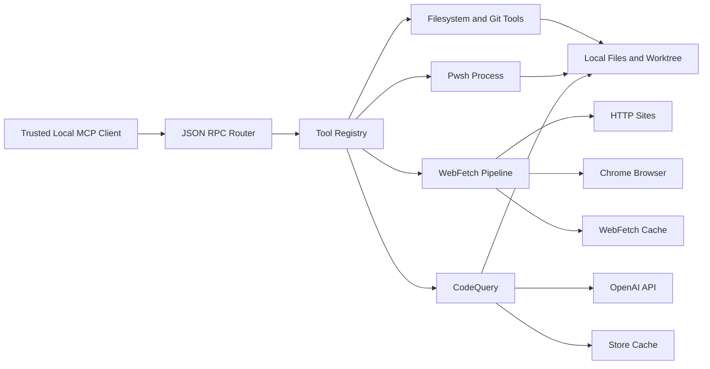

## Executive summary
`tools-mcp` is a local Rust MCP server that exposes high-impact developer tooling over JSON-RPC on stdin/stdout. In the validated local-trusted deployment, the top risks are not internet-facing auth bypasses but control-plane misuse: arbitrary host command execution through `Pwsh`, out-of-scope filesystem mutation because write/edit/delete/move/copy paths are not confined to the current working directory, confidentiality loss from intentional `CodeQuery` uploads to OpenAI, and host compromise or persistence risks in `WebFetch` browser/cache paths. The highest-value review focus is therefore the boundary between trusted MCP caller intent and powerful local side effects, especially where the repo currently lacks path-scoping and in-repo policy enforcement.

## Scope and assumptions
- In scope:
  - Runtime MCP server and tool routing in `tools-mcp-server/src/main.rs`, `tools-mcp-server/src/mcp_server.rs`, and `tools-mcp-server/src/composition.rs`.
  - Registered runtime tools with local side effects or external egress: filesystem tools, git tools, `Pwsh`, `WebFetch`, and `CodeQuery`.
  - Local caches and browser subprocesses used by `WebFetch` and `CodeQuery`.
- Out of scope:
  - CI/release processes and external wrappers not present in this repo.
  - Standalone third-party use of the `file_search_core` library outside this MCP server.
- Validated assumptions:
  - The server is used only by a local trusted client, not remote or multi-tenant callers.
  - Uploading repository content to OpenAI for `CodeQuery` is allowed for all target repos.
  - `Pwsh` is gated by deployment-time environment configuration, but that gate is not enforced in this repository.
  - Desired integrity boundary: only the current working directory and its subdirectories should be modifiable.
- Explicit assumptions that materially affect ranking:
  - A compromised local agent, prompt-injected tool-using model, or malicious content source can still influence tool arguments even in a "trusted local" deployment.
  - The repo itself is the last in-repo enforcement point for path scoping; no code-enforced mutation boundary currently exists.

Open questions that would materially change the risk ranking:
- Whether the external `Pwsh` gate is mandatory and fail-closed for all production invocations.
- Whether local file reads outside the working tree are intentionally allowed, or only modifications should be constrained.

## System model
### Primary components
- `MCP transport/router`: Reads JSON-RPC from stdin/stdout and dispatches `mcp/tools/call` requests without an internal authn/authz layer. Evidence anchors: `tools-mcp-server/src/main.rs::main`, `tools-mcp-server/src/mcp_server.rs::dispatch_jsonrpc_request`.
- `Tool registry/control plane`: Registers all callable tools, including mutating git, file, network, and process-execution tools. Evidence anchors: `tools-mcp-server/src/composition.rs::build_tool_registry`, `tools-mcp-core/src/tool_registry.rs::ToolRegistry::call`.
- `Local filesystem and git layer`: Provides `Read`, `Edit`, `Write`, `Delete`, `Move`, `Copy`, `ListDir`, `Glob`, and multiple git helpers over caller-supplied paths and working directories. Evidence anchors: `tools-mcp-local/src/tools/write.rs::handle_write`, `tools-mcp-local/src/tools/delete.rs::handle_delete`, `tools-mcp-local/src/tools/fileops.rs::handle_move`, `tools-mcp-local/src/smart_file_edit/mod.rs::handle_edit`, `tools-mcp-git/src/git/handlers/mutating.rs`.
- `Process execution layer`: Executes arbitrary PowerShell commands and git subprocesses with timeouts and output caps. Evidence anchors: `tools-mcp-local/src/tools/pwsh.rs::execute_pwsh`, `tools-mcp-core/src/process.rs::wait_with_limits`, `tools-mcp-git/src/git/mod.rs::run_git`.
- `WebFetch pipeline`: Fetches remote pages over HTTP or headless Chrome with SSRF validation, robots checks, extraction, chunking, and disk caching. Evidence anchors: `tools-mcp-webfetch/src/webfetch_tool.rs::handle_webfetch`, `tools-mcp-webfetch/src/webfetch/mod.rs::run_fetch`, `tools-mcp-webfetch/src/webfetch/http.rs::fetch_document`, `tools-mcp-webfetch/src/webfetch/browser.rs::spawn_browser`.
- `CodeQuery/OpenAI integration`: Auto-discovers local files, resolves or creates vector stores, uploads indexable files to OpenAI, and queries them. Evidence anchors: `tools-mcp-codequery/src/tool_handler.rs::handle_code_query`, `tools-mcp-codequery/src/tool_handler.rs::discover_default_file_paths`, `openai-file-search-core/src/files.rs::upload_file`, `openai-file-search-core/src/reindex.rs::code_query`.

### Data flows and trust boundaries
- Trusted local MCP client -> MCP server router
  - Data types: JSON-RPC method names, tool names, tool arguments, filesystem paths, URLs, commands.
  - Channel/protocol: stdin/stdout JSON-RPC 2.0.
  - Security guarantees: local-process transport only under the validated deployment assumption.
  - Validation and enforcement: request parsing and tool schema validation only; no in-repo caller authentication or authorization. Evidence anchors: `tools-mcp-server/src/main.rs::main`, `tools-mcp-server/src/mcp_server.rs::dispatch_jsonrpc_request`.
- MCP server -> local filesystem and git worktree
  - Data types: file paths, snippets, file contents, directories, git refs, patch output directories.
  - Channel/protocol: direct local filesystem syscalls and `git` subprocesses.
  - Security guarantees: tool-specific validation such as non-empty arguments and some existence checks.
  - Validation and enforcement: no central confinement to current working directory/subdirectories for mutation paths. Evidence anchors: `tools-mcp-local/src/tools/write.rs::handle_write`, `tools-mcp-local/src/tools/delete.rs::handle_delete`, `tools-mcp-local/src/tools/fileops.rs::handle_move`, `tools-mcp-local/src/smart_file_edit/mod.rs::apply_snippet_edit_impl`, `tools-mcp-git/src/git/mod.rs::run_git`.
- MCP server -> PowerShell process
  - Data types: arbitrary command strings, working directory, stdout/stderr.
  - Channel/protocol: local subprocess via `pwsh -Command`.
  - Security guarantees: timeout and output capture limits.
  - Validation and enforcement: no in-repo command allowlist or env-gate check found; deployment gate is external. Evidence anchors: `tools-mcp-local/src/tools/pwsh.rs::execute_pwsh`, `tools-mcp-core/src/process.rs::wait_with_limits`.
- MCP server -> remote websites via WebFetch
  - Data types: URLs, fetched page bodies, rendered HTML, extracted markdown, robots metadata.
  - Channel/protocol: outbound HTTP(S) and Chrome DevTools Protocol to a local browser process.
  - Security guarantees: SSRF scheme/IP/DNS validation, DNS pinning, manual redirect validation, robots.txt checks.
  - Validation and enforcement: no content trust; fetched content remains untrusted prompt material after extraction. Evidence anchors: `src/webfetch/http.rs::validate_url_ssrf`, `src/webfetch/http.rs::fetch_document`, `src/webfetch/mod.rs::try_browser_render`, `src/webfetch/extract.rs::extract`.
- MCP server -> OpenAI API via CodeQuery
  - Data types: API key, local source files, vector store metadata, semantic search queries, model responses.
  - Channel/protocol: outbound HTTPS to OpenAI.
  - Security guarantees: API key required, local-only path restriction inside `CodeQuery`, `.gitignore`-aware discovery, indexable-file filtering.
  - Validation and enforcement: no secret-aware upload policy or approval step before sending repo contents off-host. Evidence anchors: `tools-mcp-codequery/src/tool_handler.rs::handle_code_query`, `tools-mcp-codequery/src/tool_handler.rs::discover_default_file_paths`, `openai-file-search-core/src/files.rs::upload_file`, `openai-file-search-core/src/reindex.rs::code_query`.
- MCP server -> local cache and browser state
  - Data types: fetched page bodies, content types, timestamps, vector-store ID mappings.
  - Channel/protocol: local temp-dir and home-dir file writes plus Chrome child process state.
  - Security guarantees: hash-based cache filenames and bounded robots cache map.
  - Validation and enforcement: web cache has no expiry or size cap; browser runs with `--no-sandbox`. Evidence anchors: `tools-mcp-webfetch/src/webfetch/cache.rs::write_cache`, `tools-mcp-webfetch/src/webfetch/cache.rs::cache_root`, `tools-mcp-webfetch/src/webfetch/browser.rs::spawn_browser`, `tools-mcp-codequery/src/codequery_cache.rs`.

#### Diagram

## Assets and security objectives
| Asset | Why it matters | Security objective (C/I/A) |
| --- | --- | --- |
| Local repository contents | Source, configs, and developer work product can be exfiltrated or corrupted. | C/I |
| Files outside the current working tree | Without path scoping, mutation tools can damage unrelated local files. | I/A |
| Git worktree and history | Destructive git operations can discard or rewrite developer work. | I/A |
| Host command execution capability | `Pwsh` can read secrets, modify the OS/user profile, and exfiltrate data. | C/I/A |
| `OPENAI_API_KEY` and other local secrets reachable by commands | Credential theft expands impact beyond this repo. | C |
| OpenAI-uploaded repo content and vector stores | Intentional third-party egress can still leak sensitive code or embedded secrets. | C |
| WebFetch browser/cache state | Cached pages may contain sensitive material; browser compromise could impact the host. | C/I/A |
| MCP control channel trust | If tool invocation intent is subverted, the server exposes powerful local side effects. | I/A |

## Attacker model
### Capabilities
- Influence a trusted local agent or user to issue crafted MCP tool calls.
- Control remote web content fetched by `WebFetch`, including prompt-injection text and browser-targeted content.
- Supply crafted file paths, working directories, git refs, URLs, and PowerShell commands if they gain influence over tool selection.
- Place secrets inside repo files that are later uploaded through `CodeQuery`, intentionally or accidentally.

### Non-capabilities
- No assumed unauthenticated remote network access to the MCP server in the validated deployment.
- No assumed multi-tenant execution or shared-host isolation boundary inside this repo.
- No assumed kernel-level privilege escalation without an additional browser or host exploit.

## Entry points and attack surfaces
| Surface | How reached | Trust boundary | Notes | Evidence (repo path / symbol) |
| --- | --- | --- | --- | --- |
| JSON-RPC tool invocation | `mcp/tools/call` over stdin/stdout | Client -> MCP router | Generic control plane for all higher-risk tools. | `tools-mcp-server/src/mcp_server.rs::dispatch_jsonrpc_request` |
| Filesystem mutation tools | `Write`, `Edit`, `Delete`, `Move`, `Copy` | Router -> local filesystem | Paths are caller-controlled; no central cwd confinement found. | `tools-mcp-local/src/tools/write.rs::handle_write`, `tools-mcp-local/src/smart_file_edit/mod.rs::handle_edit`, `tools-mcp-local/src/tools/delete.rs::handle_delete`, `tools-mcp-local/src/tools/fileops.rs::handle_move` |
| Git mutation tools | `GitRestore`, `GitCheckout`, `GitStash`, `GitAdd`, `GitCommit`, `GitDiff` with `output_dir` | Router -> `git` subprocess / worktree | Can discard work, change branches, stage, commit, or write patch files. | `tools-mcp-git/src/git/handlers/mutating.rs`, `tools-mcp-git/src/git/mod.rs::run_git` |
| PowerShell execution | `Pwsh` | Router -> `pwsh` subprocess | Highest-impact local execution surface. | `tools-mcp-local/src/tools/pwsh.rs::execute_pwsh`, `tools-mcp-core/src/process.rs::wait_with_limits` |
| Remote fetch | `WebFetch` | Router -> remote HTTP/browser | Hardened for SSRF and robots, but remote content remains attacker-controlled input. | `tools-mcp-webfetch/src/webfetch_tool.rs::handle_webfetch`, `tools-mcp-webfetch/src/webfetch/http.rs::fetch_document` |
| Browser rendering | `WebFetch` with `force_browser` or JS-heavy detection | WebFetch -> Chrome process | Browser runs with `--no-sandbox`. | `src/webfetch/mod.rs::try_browser_render`, `src/webfetch/browser.rs::spawn_browser` |
| OpenAI code indexing/search | `CodeQuery` | Router -> OpenAI API | Auto-discovers and uploads local repo files by default. | `tools-mcp-codequery/src/tool_handler.rs::handle_code_query`, `openai-file-search-core/src/files.rs::upload_file` |
| Local file discovery/read/search | `Read`, `Search`, `Glob`, `ListDir` | Router -> local filesystem / subprocess | Broad local visibility increases reconnaissance value for later misuse. | `tools-mcp-local/src/tools/handlers/read_file.rs::handle_read_file`, `tools-mcp-local/src/tools/handlers/ripgrep.rs::handle_ripgrep`, `tools-mcp-local/src/tools/glob.rs::handle_glob`, `tools-mcp-local/src/tools/fileops.rs::handle_listdir` |

## Top abuse paths
1. Host command execution and exfiltration
   1. An attacker influences the trusted local client to invoke `Pwsh`.
   2. The server forwards the supplied string to `pwsh -Command`.
   3. The command reads secrets, modifies files, or sends data off-host.
   4. Impact: host-level confidentiality and integrity loss.
2. Out-of-scope file modification
   1. An attacker influences a `Write`, `Edit`, `Delete`, `Move`, or `Copy` request.
   2. The tool accepts an absolute or relative path outside the working tree.
   3. The server mutates unrelated local files because no central cwd boundary is enforced.
   4. Impact: integrity loss to arbitrary local files and persistent developer-environment tampering.
3. Git work destruction
   1. An attacker influences invocation of `GitRestore`, `GitCheckout`, or `GitStash`.
   2. The tool runs `git` with destructive arguments against a caller-selected working directory.
   3. Local changes are discarded or the worktree is shifted unexpectedly.
   4. Impact: loss of uncommitted work and integrity/availability damage to the repo.
4. Intentional but over-broad third-party code egress
   1. `CodeQuery` auto-discovers files under the current directory.
   2. Indexed source files are uploaded to OpenAI vector stores.
   3. Sensitive code or embedded secrets in source are copied to a third party.
   4. Impact: confidentiality loss outside the host.
5. Browser-mediated host compromise
   1. An attacker controls a page fetched through `WebFetch`.
   2. The pipeline decides browser rendering is needed or `force_browser` is used.
   3. Headless Chrome processes the page with `--no-sandbox`.
   4. Impact: if a browser exploit exists, host compromise impact is higher than a sandboxed browser path.
6. Cache persistence and local exposure
   1. `WebFetch` stores fetched bodies in the temp directory without expiry or size limits.
   2. Sensitive fetched data remains on disk longer than intended or cache growth is abused.
   3. Local users/processes or disk exhaustion expose or disrupt the environment.
   4. Impact: confidentiality leakage and local availability degradation.
7. Prompt-injected remote content drives unsafe tool chaining
   1. A malicious page is fetched and converted to markdown.
   2. The content instructs the trusted agent to run additional local tools.
   3. The server treats resulting tool calls as legitimate because it has no intent-aware policy layer.
   4. Impact: secondary execution, data access, or file mutation through a compromised decision chain.

## Threat model table
| Threat ID | Threat source | Prerequisites | Threat action | Impact | Impacted assets | Existing controls (evidence) | Gaps | Recommended mitigations | Detection ideas | Likelihood | Impact severity | Priority |
| --- | --- | --- | --- | --- | --- | --- | --- | --- | --- | --- | --- | --- |
| TM-001 | Compromised or prompt-injected trusted local client | The attacker can influence tool selection or arguments, and the external `Pwsh` gate is absent, bypassed, or misconfigured. | Invoke `Pwsh` to execute arbitrary OS commands via `pwsh -Command`. | Arbitrary local command execution, secret theft, filesystem tampering, and outbound exfiltration. | Host command capability, local secrets, repo contents, files outside cwd | Explicit tool surface, timeout and output caps. Evidence: `tools-mcp-local/src/tools/pwsh.rs::execute_pwsh`, `tools-mcp-core/src/process.rs::wait_with_limits` | No repo-enforced gate, no command allowlist, no path or network intent restriction. | Add an in-repo fail-closed gate for `Pwsh`; require explicit capability token or env toggle checked in code; add optional allowlist modes; log command invocations with caller context; default-disable in production builds. | Emit structured audit events for every `Pwsh` invocation including cwd, command hash, and exit status; alert on network tools, profile writes, or paths outside cwd. | Medium | High | high |
| TM-002 | Compromised or prompt-injected trusted local client | The attacker can influence path arguments to mutating file tools. | Modify, create, move, copy, or delete files outside the current working tree because raw paths are used directly. | Integrity damage to arbitrary local files and persistent environment tampering. | Files outside cwd, local repo contents, developer config files | Tool-specific argument validation and `Write` uses `create_new`. Evidence: `tools-mcp-local/src/tools/write.rs::handle_write`, `tools-mcp-local/src/tools/delete.rs::handle_delete`, `tools-mcp-local/src/tools/fileops.rs::handle_move`, `tools-mcp-local/src/smart_file_edit/mod.rs::apply_snippet_edit_impl` | No centralized path boundary enforcing "cwd and subdirectories only" for mutable operations. | Introduce a shared path policy module that canonicalizes targets and rejects mutations outside `std::env::current_dir()` descendants; apply it to `Write`, `Edit`, `Delete`, `Move`, `Copy`, and any patch-output paths. | Log canonical target paths and rejected out-of-scope attempts; alert on absolute paths, parent traversal, or writes outside repo root. | Medium | High | high |
| TM-003 | Compromised or prompt-injected trusted local client | The attacker can invoke git mutation tools against a chosen working directory. | Use `GitRestore`, `GitCheckout`, `GitStash`, or similar tools to discard or destabilize local work. | Loss of uncommitted work, integrity damage to the worktree, and developer productivity loss. | Git worktree and history, local repo contents | Git uses explicit subprocess invocation with deterministic args and timeouts. Evidence: `tools-mcp-git/src/git/mod.rs::run_git`, `tools-mcp-git/src/git/handlers/mutating.rs::handle_git_restore`, `tools-mcp-git/src/git/handlers/mutating.rs::handle_git_checkout`, `tools-mcp-git/src/git/handlers/mutating.rs::handle_git_stash` | No higher-level policy separating read-only vs destructive git operations; arbitrary working directories are accepted. | Split git tools into read-only and mutating capability tiers; require explicit opt-in for destructive commands; confine working directories to cwd descendants; add dry-run or confirmation modes where possible. | Audit git mutation verbs and working directories; alert on `restore`, `checkout -- <paths>`, `stash clear`, or patch writes outside cwd. | Medium | Medium | medium |
| TM-004 | Legitimate local use with overly broad data selection, or attacker-influenced `CodeQuery` scope | `OPENAI_API_KEY` is configured and `CodeQuery` is used on repos that may contain sensitive code or embedded secrets. | Auto-discover and upload local repo files to OpenAI vector stores. | Confidentiality loss to a third party and residual exposure in vector stores. | Repo contents, embedded credentials, proprietary code, vector store state | API key requirement, local-only file paths in `CodeQuery`, `.gitignore`-aware discovery, indexable/binary filtering. Evidence: `tools-mcp-codequery/src/tool_handler.rs::handle_code_query`, `tools-mcp-codequery/src/tool_handler.rs::discover_default_file_paths`, `openai-file-search-core/src/reindex.rs::code_query` | No secret scanning, no policy on sensitive paths, auto-discovery defaults can be broader than intended, auto-created stores persist. | Add allowlist/denylist path policy for `CodeQuery`; require explicit path scopes for sensitive repos; optionally scan for credential patterns before upload; support "query-only existing store" without local discovery. | Log uploaded file counts, file paths, and vector store IDs; alert on unexpected directories, unusually large indexing runs, or high-entropy secret matches pre-upload. | Medium | High | high |
| TM-005 | Malicious remote website content | A trusted client invokes `WebFetch` on attacker-controlled content and browser rendering is used. | Trigger rendering in headless Chrome running with `--no-sandbox`. | Browser exploit impact is amplified to host-level compromise or persistence. | Host integrity/availability, local secrets, browser process | SSRF validation, DNS pinning, manual redirect checks, robots compliance, browser availability checks. Evidence: `src/webfetch/http.rs::validate_url_ssrf`, `src/webfetch/http.rs::fetch_document`, `src/webfetch/mod.rs::try_browser_render` | Browser runs with `--no-sandbox`; no site isolation or dedicated low-privilege sandbox boundary in repo. | Prefer HTTP mode by default; isolate browser rendering in a dedicated sandbox/container/VM; disable browser mode unless explicitly needed; document high-trust requirement for `force_browser`. | Log all browser-rendered fetches with URL and rendering reason; alert on high-risk domains, repeated browser failures, or crash signatures. | Low | High | medium |
| TM-006 | Malicious or sensitive remote content, or local co-tenant process | `WebFetch` is used on sensitive pages or at volume over time. | Persist sensitive content indefinitely in the temp-dir cache or grow cache until local disk pressure occurs. | Local confidentiality leakage and availability degradation. | WebFetch cache contents, local disk availability | Cache filenames are hashed; browser and HTTP caches are separated. Evidence: `src/webfetch/cache.rs::cache_path_for`, `src/webfetch/cache.rs::write_cache`, `src/webfetch/mod.rs::run_fetch` | No expiry, no size bound, no explicit cache clearing API, temp-dir storage may be shared broadly. | Add TTL, size quotas, least-privilege file permissions, and explicit cache-clear controls; allow disabling cache for sensitive fetches by policy, not just per-request. | Track cache size and entry count; alert on rapid growth or oversized entries; optionally emit per-fetch cache metadata. | Medium | Medium | medium |
| TM-007 | Malicious remote content influencing a trusted agent | The trusted agent consumes fetched markdown as instructions rather than untrusted content. | Use prompt injection from `WebFetch` output to induce follow-on local tool calls. | Secondary execution, exfiltration, or destructive file operations through compromised tool intent. | MCP control channel trust, repo contents, host command capability | Some HTML boilerplate is stripped and scripts are removed from extracted markdown. Evidence: `src/webfetch/extract.rs::clean_markdown`, `README.md` notes fetched content is untrusted | No in-band taint tracking, no policy barrier preventing fetched content from driving dangerous subsequent tools. | Mark `WebFetch` output as tainted in response schema; require explicit user/agent acknowledgment before tainted content can trigger `Pwsh` or mutating tools; add policy hooks for cross-tool chaining. | Log tool chains that begin with `WebFetch` and end in mutation or execution; alert on high-risk sequences like `WebFetch -> Pwsh` or `WebFetch -> Write/Edit/Delete`. | Medium | High | high |

## Criticality calibration
- `critical` for this repo means a path that hands an attacker arbitrary host control or arbitrary out-of-scope file mutation with little additional effort, even in a local-only deployment.
  - Example: `Pwsh` command execution if the external env gate fails open or is bypassed.
  - Example: write/delete/move/edit operations against absolute paths outside the current working directory.
  - Example: a successful browser exploit against `WebFetch` browser mode running with `--no-sandbox`.
- `high` means material confidentiality or integrity loss to the local developer environment or third-party services, but with stronger preconditions or partially compensating deployment assumptions.
  - Example: `CodeQuery` uploading sensitive repo files or embedded secrets to OpenAI.
  - Example: prompt-injected `WebFetch` content driving a trusted agent into `Pwsh` or filesystem mutation.
  - Example: destructive git operations discarding local work in a selected repository.
- `medium` means meaningful but narrower local harm or issues that depend on additional operator mistakes, persistence, or local co-tenancy.
  - Example: indefinite `WebFetch` cache retention exposing fetched content on disk.
  - Example: cache growth or repeated fetches degrading local disk availability.
  - Example: destructive git operations where the outer caller is already trusted and scope is repo-limited.
- `low` means noisy or constrained issues with limited blast radius in the validated local-trusted deployment.
  - Example: non-sensitive file listing or search reconnaissance within the expected repo.
  - Example: benign `WebFetch` HTTP errors or robots-denied fetch attempts.
  - Example: prompt-injection text that is surfaced but not acted upon by the caller.

## Focus paths for security review
| Path | Why it matters | Related Threat IDs |
| --- | --- | --- |
| `tools-mcp-server/src/mcp_server.rs` | Single tool-call control plane without internal authz gates. | TM-001, TM-002, TM-007 |
| `tools-mcp-server/src/composition.rs` | Enumerates every registered runtime capability exposed to callers. | TM-001, TM-002, TM-003 |
| `tools-mcp-local/src/tools/pwsh.rs` | Exposes arbitrary PowerShell execution to MCP callers. | TM-001 |
| `tools-mcp-core/src/process.rs` | Core subprocess wait/drain plumbing shared by PowerShell and git tools. | TM-001, TM-005 |
| `tools-mcp-local/src/tools/write.rs` | Creates caller-chosen files without cwd confinement. | TM-002 |
| `tools-mcp-local/src/tools/delete.rs` | Deletes caller-chosen files without cwd confinement. | TM-002 |
| `tools-mcp-local/src/tools/fileops.rs` | Move/copy/list operations accept arbitrary paths and can mutate directories recursively. | TM-002 |
| `tools-mcp-local/src/smart_file_edit/mod.rs` | Edit path is powerful and lacks a shared path policy despite stale-file protections. | TM-002 |
| `tools-mcp-git/src/git/handlers/mutating.rs` | Houses destructive git operations and patch-output writing. | TM-003 |
| `tools-mcp-git/src/git/mod.rs` | Executes `git` with caller-controlled working directories. | TM-003 |
| `tools-mcp-codequery/src/tool_handler.rs` | Auto-discovers local files, resolves vector stores, and drives OpenAI egress defaults. | TM-004 |
| `openai-file-search-core/src/reindex.rs` | Implements upload/query orchestration and the off-host confidentiality boundary. | TM-004 |
| `tools-mcp-webfetch/src/webfetch/http.rs` | Main SSRF, DNS pinning, redirect, and robots enforcement boundary. | TM-005, TM-007 |
| `tools-mcp-webfetch/src/webfetch/browser.rs` | Browser subprocess configuration includes `--no-sandbox`. | TM-005 |
| `tools-mcp-webfetch/src/webfetch/cache.rs` | Cache persistence has no TTL or size cap. | TM-006 |
| `tools-mcp-webfetch/src/webfetch/extract.rs` | Output sanitization is content-cleaning, not a true prompt-injection control. | TM-007 |

## Quality check
- Covered all primary entry points discovered in the registered runtime tool set.
- Represented each major trust boundary in at least one threat: MCP caller, local filesystem, git/process execution, remote web content, browser subprocess, OpenAI egress, and local caches.
- Separated runtime behavior from tests and build/dev tooling; tests were used only as evidence of intended behavior.
- Reflected user clarifications: local trusted deployment, OpenAI egress allowed, external `Pwsh` env gate, and desired cwd-only modification policy.
- Kept explicit assumptions and residual open questions visible where they materially affect ranking.
